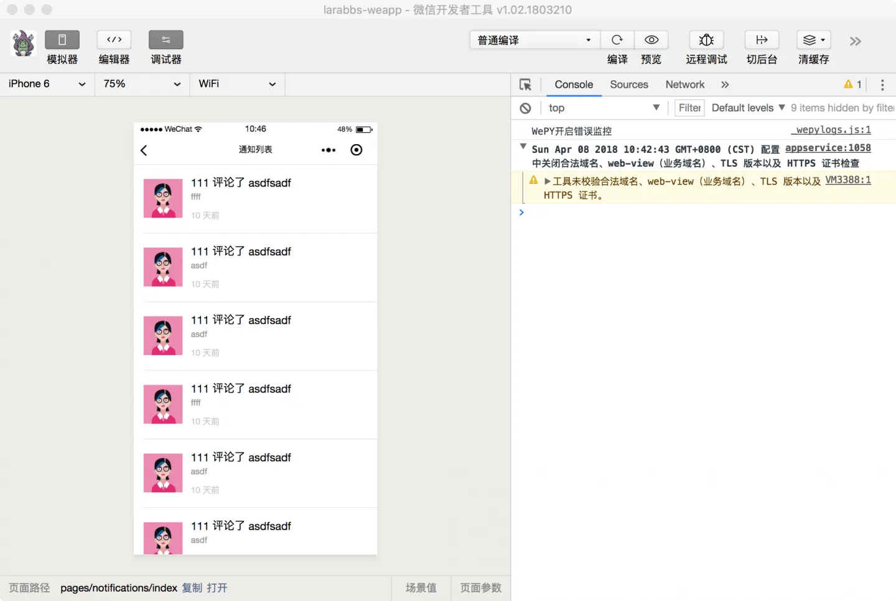
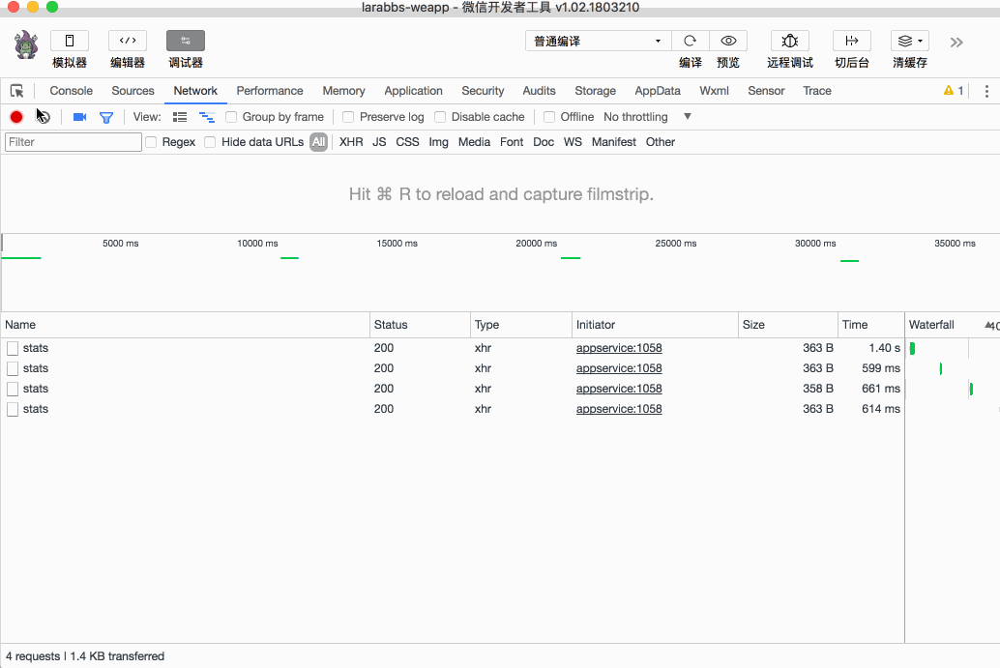

# 8.5. 消息列表

原文链接：https://learnku.com/courses/laravel-weapp/1.7/the-list-of-messages/1601

本教程最新版为 [2.1](https://learnku.com/courses/laravel-weapp/2.1)，当前版本已放弃维护，请阅读最新版本！

## 消息列表

我们还需要一个消息列表页面，显示所有的消息通知，可以下拉刷新，上拉加载更多。

## 创建页面

创建消息列表页面：

```
$ cd ~/Code/larabbs-weapp
$ mkdir src/pages/notifications
$ touch src/pages/notifications/index.wpy
```

注册消息列表页面：
src/app.wpy

```
.
.
.
config = {
pages: [
.
.
.
'pages/replies/create',
'pages/notifications/index'
],
.
.
.
```

在 `我的` 页面为 `我的消息` 增加链接 `/pages/notifications/index`：
src/pages/users/me.wpy

```
.
.
.
<navigator class="weui-cell weui-cell_access" url="{{ user ? '/pages/notifications/index' : '' }}">
<view class="weui-cell__bd" url="">
<view class="weui-cell__bd">
<view style="display: inline-block; vertical-align: middle">我的消息</view>
<view class="weui-badge" style="margin-left: 5px;" wx:if="{{ unreadCount }}">{{ unreadCount }}</view>
</view>
</view>
<view class="weui-cell__ft weui-cell__ft_in-access"></view>
</navigator>
.
.
.
```

## 处理页面逻辑

src/pages/notifications/index.wpy

```
<template>
<view class="page">
<view class="page__bd">
<view class="weui-panel weui-panel_access">
<view class="weui-panel__bd">
<repeat for="{{ notifications }}" wx:key="id" index="index" item="notification">
<view class="weui-media-box weui-media-box_appmsg" hover-class="weui-cell_active">
<navigator class="weui-media-box__hd weui-media-box__hd_in-appmsg" url="/pages/users/show?id={{ notification.data.user_id }}">
<image class="notificationer-avatar weui-media-box__thumb" src="{{ notification.data.user_avatar }}" />
</navigator>
<view class="weui-media-box__bd weui-media-box__bd_in-appmsg">

<navigator class="weui-media-box__title" url="/pages/topics/show?id={{ notification.data.topic_id }}">
<view style="display: inline-block; vertical-align: middle">{{ notification.data.user_name }}</view>
评论了
<view style="display: inline-block; vertical-align: middle">{{ notification.data.topic_title }}</view>
</navigator>

<view class="weui-media-box__desc"><rich-text nodes="{{ notification.data.reply_content }}" bindtap="tap"></rich-text></view>
<view class="weui-media-box__info">
<view class="weui-media-box__info__meta">{{ notification.created_at_diff }}</view>
</view>
</view>
</view>
</repeat>
<view class="weui-loadmore weui-loadmore_line" wx:if="{{ noMoreData }}">
<view class="weui-loadmore__tips weui-loadmore__tips_in-line">没有更多数据</view>
</view>
</view>
</view>
</view>
</view>
</template>
<script>
import wepy from 'wepy'
import util from '@/utils/util'
import api from '@/utils/api'

export default class NotificationIndex extends wepy.page {
config = {
enablePullDownRefresh: true,
navigationBarTitleText: '通知列表'
}
data = {
// 消息数据
notifications: [],
// 是否有更多数据
noMoreData: false,
// 是否正在加载
isLoading: false,
// 当前分页
page: 1
}
// 获取消息
async getNotifications(reset = false) {
try {
let notificationResponse = await api.authRequest({
url: 'user/notifications',
data: {
page: this.page
}
})

if (notificationResponse.statusCode === 200) {
let notifications = notificationResponse.data.data

// 格式化 created_at
notifications.forEach(function (notification) {
notification.created_at_diff = util.diffForHumans(notification.created_at)
})
// 覆盖还是合并数据
this.notifications = reset ? notifications : this.notifications.concat(notifications)

let pagination = notificationResponse.data.meta.pagination

// 根据分页判断是否有更多数据
if (pagination.current_page === pagination.total_pages) {
this.noMoreData = true
}
this.$apply()
}

return notificationResponse
} catch (err) {
console.log(err)
wepy.showModal({
title: '提示',
content: '服务器错误，请联系管理员'
})
}
}
async onLoad() {
this.getNotifications()
}
// 下拉刷新
async onPullDownRefresh() {
this.noMoreData = false
this.page = 1
await this.getNotifications(true)
wepy.stopPullDownRefresh()
}
// 加载更多
async onReachBottom () {
// 没有更多数据或这在加载则返回
if (this.noMoreData || this.isLoading) {
return
}
this.isLoading = true
this.page = this.page + 1
await this.getNotifications()
this.isLoading = false
this.$apply()
}
}
</script>

```

进入 `我的` 页面，点击 `我的消息`，可以进入通知列表页面：



代码逻辑同前几节课程的列表逻辑，代码中有详细注释，在这里就不再详解。

## 标记消息为已读

未读消息提示和消息列表功能已经完成了，但是还需要将未读消息设置为已读。

### 修改 Larabbs 接口

因为微信不支持 PATCH 请求，所以对 LaraBBS 中的 `标记消息通知为已读` 接口增加一个对应的 PUT 请求：

routes/api.php

```
.
.
.
// 标记消息通知为已读
$api->patch('user/read/notifications', 'NotificationsController@read')
->name('api.user.notifications.read');
$api->put('user/read/notifications', 'NotificationsController@read')
->name('api.user.notifications.read.put');
.
.
.
```

### 修改代码

src/pages/notifications/index.wpy

```
.
.
.
async onLoad() {
this.getNotifications()
this.markAsRead()
}
async markAsRead() {
try {
// 标记消息为已读，不显示 loading 框
let markResponse = await api.authRequest({
url: 'user/read/notifications',
method: 'PUT'
}, false)

if (markResponse.statusCode === 204) {
// 设置全局未读消息为 0
this.$parent.globalData.unreadCount = 0
this.$apply()
}
} catch (err) {
console.log(err)
wepy.showModal({
title: '提示',
content: '服务器错误，请联系管理员'
})
}
}
// 下拉刷新
async onPullDownRefresh() {
this.noMoreData = false
this.page = 1
await this.getNotifications(true)
// 设置消息已读
this.markAsRead()
wepy.stopPullDownRefresh()
}
.
.
.
```

增加 `markAsRead` 方法，调用接口将消息设置为已读，并设置全局的 `unreadCount` 为 0，在首次进入页面（onLoad）以及下拉刷新（onPullDownRefresh）时调用 `this.markAsRead()`。

### 开发者工具调试

为当前用户制造一些未读消息，然后点击进入 `消息列表`，已读消息数变为 0 ：



## 代码版本控制

```
$ cd ~/Code/larabbs-weapp
$ git add -A
$ git commit -m 'page notification index'
```
