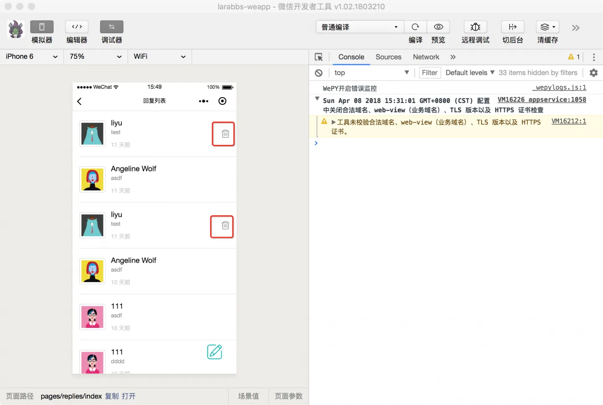
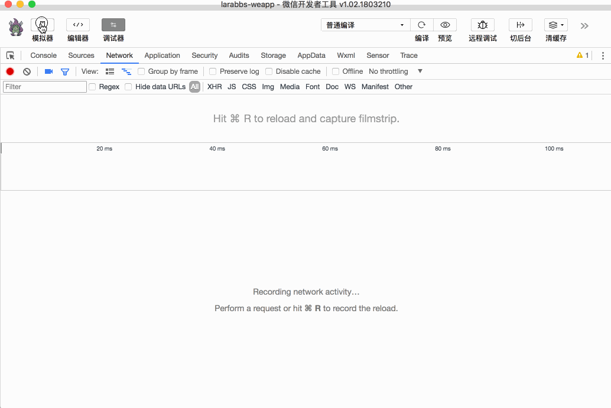

# 8.6. 删除回复

原文链接：https://learnku.com/courses/laravel-weapp/1.7/delete-reply/1477

本教程最新版为 [2.1](https://learnku.com/courses/laravel-weapp/2.1)，当前版本已放弃维护，请阅读最新版本！

## 删除回复

这一节我们实现删除回复的功能。首先去 [iconfont](http://www.iconfont.cn/) 找一个合适的删除图标，命名为 trash.png ，存入 src/images 目录中。


## 增加删除按钮

在回复列表中，增加删除按钮：

src/pages/replies/index.wpy

```
.
.
.
.reply-delete {
width: 20px;
height: 20px;
}
.
.
.
<repeat for="{{ replies }}" wx:key="id" index="index" item="reply">
<view class="weui-media-box weui-media-box_appmsg" hover-class="weui-cell_active">
.
.
.
<image wx:if="{{ reply.can_delete }}" class="reply-delete" src="/images/trash.png" @tap="deleteReply({{ reply.topic_id }}, {{ reply.id }})"/>
</view>
</repeat>
.
.
.
```

分析一下页面逻辑：

1. 每个回复最后，增加刚才添加的图片，绑定 `tap` 事件，点击后调用 `deleteReply` 方法；

2. `deleteReply` 方法传入了两个参数，第一个是回复所属的话题 id，第二个是话题的 id，调用接口的时候需要用到这两个参数；

3. 根据 `wx:if="{{ reply.can_delete }}"` 控制删除图片是否显示。

## 控制按钮是否显示

修改 `replyMixin.js`，处理回复数据，增加 `can_delete` 属性：
src/mixins/replyMixin.js

```
.
.
.
async getReplies(reset = false) {
.
.
.
if (repliesResponse.statusCode === 200) {
let replies = repliesResponse.data.data

// 获取当前用户
let user = await this.$parent.getCurrentUser()
replies.forEach((reply) => {
// 控制是否可以删除
reply.can_delete = this.canDelete(user, reply)
reply.created_at_diff = util.diffForHumans(reply.created_at)
})
.
.
.
}
.
.
.
}
canDelete(user, reply) {
if (!user) {
return false
}

return (reply.user_id === user.id)
}
.
.
.
```

增加了 canDelete 方法，传入 `用户` 和 `回复` 两个对象，判断回复与用户的关系，如果回复是该用户发布的，则返回 true，否则返回 false。

获取回复数据后，forEach 处理回复数据，调用 `canDelete` 方法，赋值给 `can_delete` 属性。



使用开发者工具查看回复列表，当前用户回复的话题后面会显示删除按钮。

## 删除逻辑

因为删除是个通用逻辑，可以定义在 `replyMixin` 中：
src/mixins/replyMixin.js

```
.
.
.
methods = {
// 删除回复
async deleteReply(topicId, replyId) {
// 确认是否删除
let res = await wepy.showModal({
title: '确认删除',
content: '您确认删除该回复吗',
confirmText: '删除',
cancelText: '取消'
})

// 点击取消后返回
if (!res.confirm) {
return
}
try {
// 调用接口删除回复
let deleteResponse = await api.authRequest({
url: 'topics/' + topicId + '/replies/' + replyId,
method: 'DELETE'
})

// 删除成功
if (deleteResponse.statusCode === 204) {
wepy.showToast({
title: '删除成功',
icon: 'success',
duration: 2000
})
// 将删除了的回复移除
this.replies = this.replies.filter((reply) => reply.id !== replyId)
this.$apply()
}

return deleteResponse
} catch (err) {
console.log(err)
wepy.showModal({
title: '提示',
content: '服务器错误，请联系管理员'
})
}
}
}
.
.
.
```

注意事件方法需要添加到 `methods` 中，删除逻辑为：

1. 删除是危险操作，需要提示用户再次确认；

2. 用户确认后，调用接口删除回复；

3. 这里不涉及页面的跳转，可以直接通过 `filter` 方法把当前的回复从 `replies` 数据中移除，这样页面中对应的回复也被移除。

## 开发者工具调试

进入某个话题的回复列表，删除某个自己发布的回复，可正确删除：



## 代码版本控制

```bash
$ cd ~/Code/larabbs-weapp
$ git add -A
$ git commit -m 'reply delete'
```
