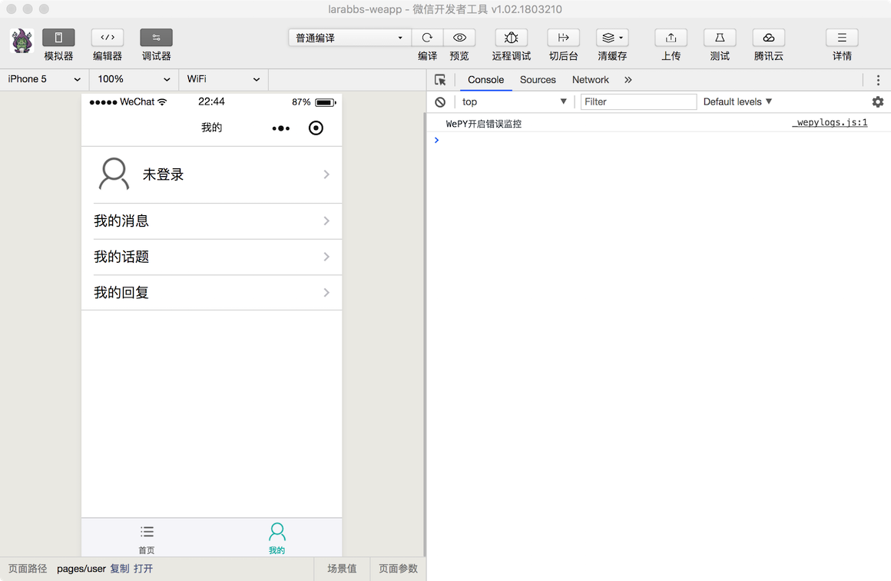
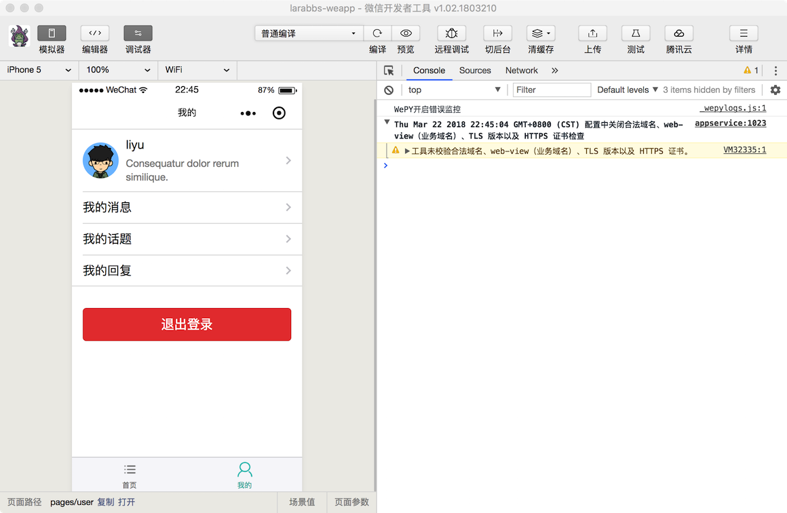
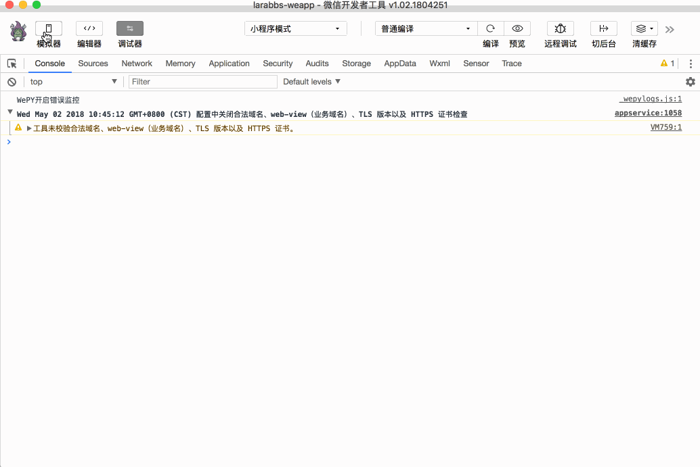

# 6.1. 用户基本信息

原文链接：https://learnku.com/courses/laravel-weapp/1.7/authorizing-the-users-basic-information/1464

本教程最新版为 [2.1](https://learnku.com/courses/laravel-weapp/2.1)，当前版本已放弃维护，请阅读最新版本！

## 用户基本信息

这一节我们来优化 `我的` 页面，下面是完成后的样子：





我们已经可以正确的获取用户 token 了，接下来需要获取登录用户的基本信息，小程序提供了获取用户信息的接口 `wx.getUserInfo`，用户授权后就能获取微信的个人信息，但是 Larabbs 不仅仅是个小程序应用，小程序用户是与 Larabbs 中已有用户进行绑定的，所以我们需要调用 Larabbs 的 `获取登录用户信息` 接口获取用户信息。

## 封装获取用户详情

不单单只有 `我的` 页面需要获取当前用户信息，在其他页面也有可能获取用户信息，例如拿到当前用户 id 与文章发布者 id 进行对比，确认文章是当前用户发布的。所以当前用户的信息需要放在数据缓存（Storage）中，供全局使用。

src/app.wpy

```
.
.
.
import 'wepy-async-function'
import api from '@/utils/api'
.
.
.
// 获取当前登录用户信息
async getCurrentUser () {
// 如果用户未登录
if (!this.checkLogin()) {
return null
}

// 从缓存中获取用户信息
let user = wepy.getStorageSync('user')

try {
// 登录了但是缓存中没有，请求接口获取
if (!user) {
let userResponse = await api.authRequest('user')
// 状态码为 200 表示请求成功
if (userResponse.statusCode === 200) {
user = userResponse.data
wepy.setStorageSync('user', user)
}
}
} catch (err) {
console.log(err)
wepy.showModal({
title: '提示',
content: '服务器错误，请联系管理员'
})
}

return user
}

// 用户是否已经登录
checkLogin () {
return (wepy.getStorageSync('access_token') !== '')
}
.
.
.
```

定义在 `app.wpy` 中的方法是全局方法，在其他页面中可以通过 `this.$parent.checkLogin()` 调用上面定义的 `checkLogin` 方法，该方法只判断缓存中是否存在 `access_token`，存在则说明用户已经登录过了，返回 `true`，否则返回 `false`。

分析一下 `getCurrentUser` 方法的逻辑：

- 首先通过 `checkLogin` 方法判断用户是否登录，如果未登录则返回 null；

- 如果已经登录则先从缓存中获取用户信息并返回；

- 如果缓存中没有用户数据，则请求 `获取登录用户信息` 接口。

## 修改我的页面

src/pages/user.wpy

```
<style lang="less">
.avatar-wrap {
position: relative;
margin-right: 10px;
}
.avatar {
width: 50px;
height: 50px;
display: block;
border-radius: 50%;
}
.logout {
margin-top: 30px;
}
.introduction {
font-size: 13px;
color: #888888;
}
</style>
<template>
<view class="page">
<view class="page__bd" >
<view class="weui-cells weui-cells_after-title">
<!-- 已登录 -->
<navigator class="weui-cell" wx:if="{{ user }}" url>
<view class="weui-cell__hd avatar-wrap">
<image class="avatar" src="{{ user.avatar }}"/>
</view>
<view class="weui-cell__bd">
<view>{{ user.name }}</view>
<view class="page__desc">{{ user.introduction || '' }}</view>
</view>
<view class="weui-cell__ft weui-cell__ft_in-access"></view>
</navigator>
<!-- 未登录 -->
<navigator class="weui-cell" wx:else url="/pages/auth/login">
<view class="weui-cell__hd avatar-wrap">
<image src="/images/user.png" class="avatar"/>
</view>
<view class="weui-cell__bd">
<view>未登录</view>
</view>
<view class="weui-cell__ft weui-cell__ft_in-access"></view>
</navigator>
<navigator class="weui-cell weui-cell_access" url="">
<view class="weui-cell__bd" url="">
<view class="weui-cell__bd">我的消息</view>
</view>
<view class="weui-cell__ft weui-cell__ft_in-access"></view>
</navigator>
<navigator class="weui-cell weui-cell_access" url="">
<view class="weui-cell__bd" url="">
<view class="weui-cell__bd">我的话题</view>
</view>
<view class="weui-cell__ft weui-cell__ft_in-access"></view>
</navigator>
<navigator class="weui-cell weui-cell_access" url="">
<view class="weui-cell__bd" url="">
<view class="weui-cell__bd">我的回复</view>
</view>
<view class="weui-cell__ft weui-cell__ft_in-access"></view>
</navigator>
</view>
<view class="page__bd page__bd_spacing logout">
<button class="weui-btn" type="warn" wx:if="{{ user }}" @tap="logout">退出登录</button>
</view>
</view>
</view>
</template>

<script>
import wepy from 'wepy'
import api from '@/utils/api'

export default class User extends wepy.page {
config = {
navigationBarTitleText: '我的'
}
data = {
// 用户信息
user: null
}
async onShow() {
// 每次打开页面，获取当前用户信息
this.user = await this.$parent.getCurrentUser()
this.$apply()
}
methods = {
// 退出登录方法
async logout (e) {
try {
let logoutResponse = await api.logout()

if (logoutResponse.statusCode === 204) {
this.user = null
this.$apply()
}
} catch (err) {
console.log(err)
wepy.showModal({
title: '提示',
content: '服务器错误，请联系管理员'
})
}
}
};
}
</script>

```

页面逻辑很简单：

- 每次打开页面，触发 `onShow` 方法，都会去调用上一步封装的 `this.$parent.getCurrentUser()` 方法获取用户信息;

- 获取用户信息后赋值给当前页面定义的 `user` 变量;

- 页面中通过 `wx:if` 和 `wx:else` 判断 `user` 变量是否存在，显示未登录和已登录的内容；

- 用户已登录有用户信息时才会显示 `退出登录` 按钮。

我们增加了 `我的话题` ，`我的回复` 等链接，暂时还不能跳转，后面的课程中会优化这部分内容。

## 开发者工具调试



注意观察 Storage 中的内容，由于我们已经绑定了 Larabbs 中的账户，所以会直接登录成功，并设置 `access_token`，跳转回 `我的` 页面后，会触发 `onShow` 方法，由于缓存中还没有用户信息，会发送一次网络请求，请求完成后，保存到缓存中的 `user` 中，页面切换到已登录的状态。

## 代码版本控制

```
$ cd ~/Code/larabbs-weapp
$ git add -A
$ git commit -m 'page user'
```
