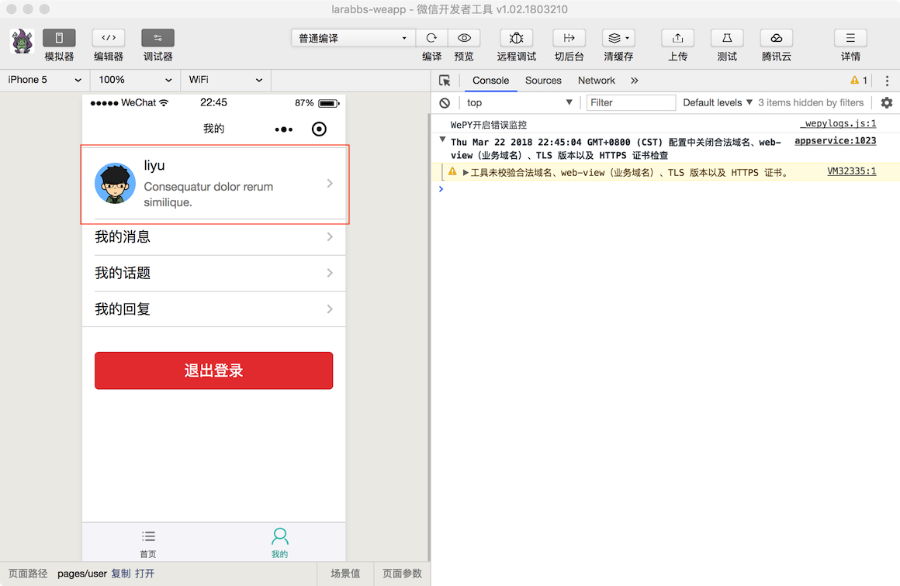
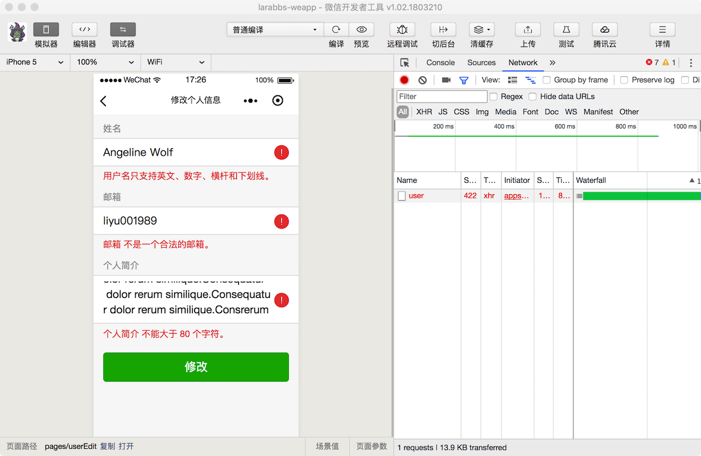
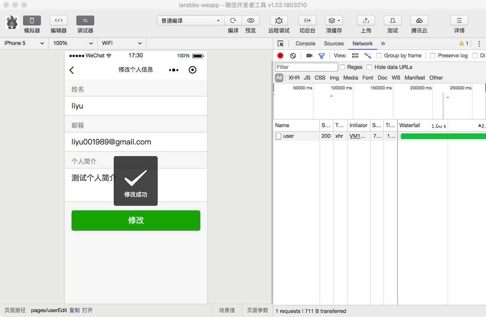
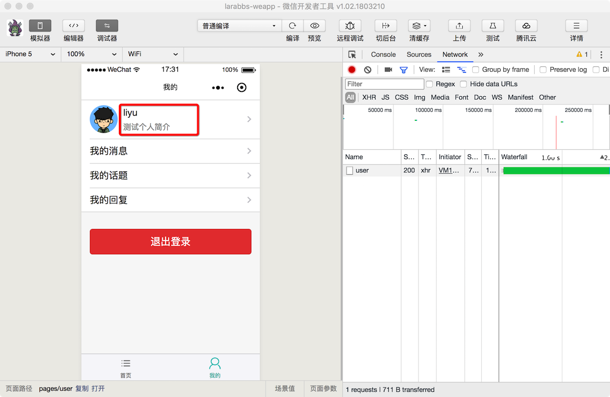

# 6.2. 编辑个人资料

原文链接：https://learnku.com/courses/laravel-weapp/1.7/editing-personal-data/1465

本教程最新版为 [2.1](https://learnku.com/courses/laravel-weapp/2.1)，当前版本已放弃维护，请阅读最新版本！

## 编辑个人资料

这一节我们来添加个人资料修改页面，进行个人资料的修改。

## 修改 LaraBBS 个人信息接口

在这之前我们需要修改一下 Larabbs 的接口，因为小程序的网络请求是不支持 `PATCH` 方法的，而 `修改个人信息接口` 因为是部分更新，所以实现接口的时候我们使用的是 `PATCH` 方法。为了适配小程序，需要做响应的修改，增加一个 `PUT` 路由。

### 修改路由

routes/api.php

```
.
.
.
// 编辑登录用户信息
$api->patch('user', 'UsersController@update')
->name('api.user.patch');
$api->put('user', 'UsersController@update')
->name('api.user.update');
.
.
.
```

我们增加了一个 `put` 的路由，同样指向 `UsersController` 的 `update` 方法。

### 修改 UserRequest

app/Http/Requests/Api/UserRequest.php

```
.
.
.
case 'PUT':
case 'PATCH':
$userId = \Auth::guard('api')->id();
return [
'name' => 'between:3,25|regex:/^[A-Za-z0-9\-\_]+$/|unique:users,name,' .$userId,
'email' => 'email',
'introduction' => 'max:80',
'avatar_image_id' => 'exists:images,id,type,avatar,user_id,'.$userId,
];
break;

.
.
```

`UserRequest` 中 `PUT` 和 `PATCH` 方法使用相同的验证规则。

## 修改个人资料页面

### 调整目录结构

接下来我们需要添加修改用户页面，按照功能区分应该创建一个 `users` 目录，而现有的 `我的` 页面也应该放入 users 目录中。

1.

首先调整一下目录结构；

```
$ cd ~/Code/larabbs-weapp
$ mkdir src/pages/users
$ mv src/pages/user.wpy src/pages/users/me.wpy
```

2.

修改 `app.wpy` 中的配置，将 `pages/user` 替换为 `pages/users/me`：

src/app.wpy

```
.
.
.
config = {
pages: [
'pages/index',
'pages/users/me',
'pages/auth/login',
'pages/auth/register',
],
.
.
.
tabBar: {
.
.
.
pagePath: 'pages/users/me',
text: '我的',
.
.
.
```

修正 `pages` 中的页面路径，修复 `tabbar` 中 `我的` 的页面位置。

3.

修改文件中的类名：

src/pages/users/me.wpy

```
export default class UserMe extends wepy.page {
```

4.

修改注册页面中的跳转链接：

src/pages/auth/register.wpy

```
.
.
.
// 跳转到我的页面
setTimeout(function() {
wepy.switchTab({
url: '/pages/users/me'
})
}, 2000)
.
.
.
```

5.

做完上面的修改，因为文件位置的改变，需要重新执行编译一下：

```
$ wepy build --watch --no-cache
```

### 创建页面

创建个人信息修改页面：

```
$ touch src/pages/users/edit.wpy
```

### 注册页面

创建页面后一定要记得，在 `src/app.wpy` 的 `config.pages` 配置中注册的页面：

src/app.wpy

```
.
.
.
config = {
pages: [
'pages/index',
'pages/users/me',
'pages/users/edit',
'pages/auth/login',
'pages/auth/register',
],
.
.
.
```

### 增加链接

src/pages/users/me.wpy

```
.
.
.
<!-- 已登录 -->
<navigator class="weui-cell" wx:if="{{ user }}" url="/pages/users/edit">
.
.
.
</navigator>
.
.
.
```

我们在 `我的` 页面 已登录的 navigator 标签中，增加了属性 `url="/pages/users/edit"` ，跳转到修改页面。



### 编辑页面

使用 Sublime 打开页面填入如下内容：

src/pages/users/edit.wpy

```
<style lang="less">
.introduction {
height: 3.3em;
}
.error-message {
color: #E64340;
}
</style>
<template>
<view class="page">
<view class="page__bd">
<form bindsubmit="submit">
<!-- 填写姓名 -->
<view class="weui-cells__title">姓名</view>
<view class="weui-cells weui-cells_after-title">
<view class="weui-cell weui-cell_input">
<view class="weui-cell__bd">
<input class="weui-input" placeholder="请输入姓名" name="name" value="{{ user.name }}" />
</view>
<view wx:if="{{ errors.name }}" class="weui-cell__ft">
<icon type="warn" size="23" color="#E64340"></icon>
</view>
</view>
</view>
<!-- 姓名错误信息 -->
<view wx:if="{{ errors.name }}" class="weui-cells__tips error-message">{{ errors.name[0] }}</view>

<!-- 填写邮箱 -->
<view class="weui-cells__title">邮箱</view>
<view class="weui-cells weui-cells_after-title">
<view class="weui-cell weui-cell_input">
<view class="weui-cell__bd">
<input class="weui-input" placeholder="请输入邮箱" name="email" value="{{ user.email }}" />
</view>
<view wx:if="{{ errors.email }}" class="weui-cell__ft">
<icon type="warn" size="23" color="#E64340"></icon>
</view>
</view>
</view>
<!-- 邮箱错误信息 -->
<view wx:if="{{ errors.email }}" class="weui-cells__tips error-message">{{ errors.email[0] }}</view>

<!-- 填写简介 -->
<view class="weui-cells__title">个人简介</view>
<view class="weui-cells weui-cells_after-title">
<view class="weui-cell">
<view class="weui-cell__bd">
<textarea class="weui-textarea introduction" placeholder="请输入简介" name="introduction" value="{{ user.introduction }}" />
</view>
<view wx:if="{{ errors.introduction }}" class="weui-cell__ft">
<icon type="warn" size="23" color="#E64340"></icon>
</view>
</view>
</view>
<!-- 简介错误信息 -->
<view wx:if="{{ errors.introduction }}" class="weui-cells__tips error-message">{{ errors.introduction[0] }}</view>

<!-- 提交表单 -->
<view class="weui-btn-area">
<button class="weui-btn" type="primary" formType="submit">修改</button>
</view>
</form>
</view>
</view>
</template>

<script>
import wepy from 'wepy'
import api from '@/utils/api'

export default class UserEdit extends wepy.page {
config = {
navigationBarTitleText: '修改个人信息'
}
data = {
// 用户信息
user: null,
// 错误信息
errors: null
}
async onShow() {
// 获取当前用户信息
this.user = await this.$parent.getCurrentUser()
this.$apply()
}
// 表单提交
async submit (e) {
this.errors = null
try {
let editResponse = await api.authRequest({
url: 'user',
method: 'PUT',
data: e.detail.value
})

// 设置报错信息
if (editResponse.statusCode === 422) {
this.errors = editResponse.data.errors
this.$apply()
}

// 请求成功，缓存用户数据
if (editResponse.statusCode === 200) {
this.user = editResponse.data
wepy.setStorageSync('user', editResponse.data)
this.$apply()

wepy.showToast({
title: '修改成功',
icon: 'success',
duration: 2000
})
}
} catch (err) {
console.log(err)
wepy.showModal({
title: '提示',
content: '服务器错误，请联系管理员'
})
}
}
}
</script>

```

分析一下页面逻辑：

1. 打开页面时，`onShow` 方法中获取用户信息；

2. 用户填写表单，可以修改 `用户姓名`、`邮箱` 和 `个人简介`，提交后调用 `submit` 方法，注意有异步操作使用 `await` 的方法需要加 `async`；

3.

如果请求接口，响应状态码为 422 则说明表单有错，将错误信息赋值给 `errors`，显示在页面中，422 的错误响应结果如下：

-

errors —— 错误内容，如果提交的字段有误，则会有对应字段的错误信息，错误信息有可能有多个，所以是个数组：

```
{
email: ["邮箱 不是一个合法的邮箱。"],
name: ["用户名必须介于 3 - 25 个字符之间。", "用户名只支持英文、数字、横杆和下划线。"]
}
```

- message —— 错误消息内容；

- status_code —— 错误响应状态码。

4. 如果响应状态码为 200，则将修改后的用户信息存入缓存，调用 `showToast` 提示修改成功。

## 开发者工具调试

在数据库中找一个已存在的用户名，将邮箱修改为错误格式，将个人简介填充超过 80 个字符。可以看到请求返回 422 错误，页面中有错误提示：



输入正确的用户信息，点击提交，修改成功：


返回 `我的` 页面，因为会重新调用 `onShow` 方法，再次获取缓存中的用户数据，所以会看到用户数据也同时更新了：


## 代码版本控制

### larabbs

```
$ cd ~/Code/larabbs
$ git add -A
$ git commit -m 'weapp update user'
```

### larabbs-weapp

```
$ cd ~/Code/larabbs-weapp
$ git add -A
$ git commit -m 'page users edit'
```
