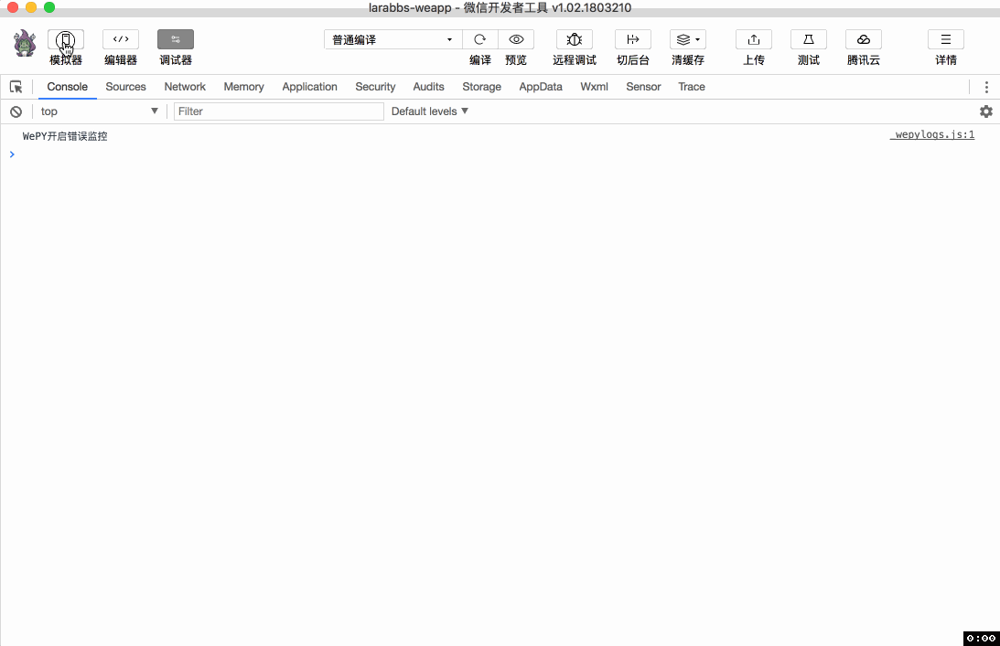

# 6.3. 上传头像

原文链接：https://learnku.com/courses/laravel-weapp/1.7/upload-a-head-image/1466

本教程最新版为 [2.1](https://learnku.com/courses/laravel-weapp/2.1)，当前版本已放弃维护，请阅读最新版本！

## 上传头像

接着上一节的内容，修改个人信息还缺少修改头像的功能，这一节我们来增加这个功能。

## 封装上传方法

在小程序中上传文件需要使用 [uploadFile](https://developers.weixin.qq.com/miniprogram/dev/api/network-file.html) 接口，同样需要添加 `Authorization` 头，为了方便使用，我们需要提前封装一下，因为是接口相关的代码，所以封装在 `utils/api.js` 文件中：

src/utils/api.js

```
.
.
.
const updateFile = async (options = {}) => {
// 显示loading
wepy.showLoading({title: '上传中'})

// 获取 token
let accessToken = await getToken()

// 拼接url
options.url = host + '/' + options.url
let header = options.header || {}
// 将 token 设置在 header 中
header.Authorization = 'Bearer ' + accessToken
options.header = header

// 上传文件
let response = await wepy.uploadFile(options)

// 隐藏 loading
wepy.hideLoading()

return response
}
.
.
.
export default {
request,
authRequest,
refreshToken,
login,
logout,
updateFile
}
```

逻辑不难理解，文件上传之前，显示上传中的 `loading` 提示，获取 Token 后设置 Authorization 头信息，调用 `wepy.uploadFile` 方法向服务器接口上传图片。

## 修改页面

修改 `edit` 页面如下：

src/pages/user/edit.wpy

```
<style lang="less">
.avatar {
width: 80px;
height: 80px;
display: block;
border-radius: 50%;
}
.avatar-wrap {
margin-top: 10px;
display: flex;
justify-content: center;
align-items: center;
}
.
.
.
</style>
<template>
<view class="page">
<view class="page__bd">
<form bindsubmit="submit">
<view class="avatar-wrap">
<image class="avatar" src="{{ user.avatar }}" @tap="updateAvatar"/>
</view>
.
.
.
</form>
</view>
</view>
</template>

<script>
import wepy from 'wepy'
import api from '@/utils/api'

export default class UserEdit extends wepy.page {
.
.
.
data = {
.
.
.
// 头像id
avatarId: 0
}
.
.
.
async submit (e) {
// 每次提交都重置错误消息
this.errors = null
try {
// e.detail.value 为表单提交的数据
let formData = e.detail.value

// 当avatarId被设置过之后则增加到 avatar_image_id 中
if (this.avatarId !== 0) {
formData.avatar_image_id = this.avatarId
}

let editResponse = await api.authRequest({
url: 'user',
method: 'PUT',
data: formData
})
.
.
.
}
methods = {
async updateAvatar () {
// 选择头像图片
let image = await wepy.chooseImage({count: 1})

try {
// 获取选择的图片
let avatar = image.tempFilePaths[0]

// 调用上传图片接口
let imageResponse = await api.updateFile({
url: 'images',
method: 'POST',
name: 'image',
formData: {
type: 'avatar'
},
filePath: avatar
})

// 上传成功成功记录数据
if (imageResponse.statusCode === 201) {
// 小程序上传结果没有做 JSON.parse，需要手动处理
let responseData = JSON.parse(imageResponse.data)
this.user.avatar = responseData.path
this.avatarId = responseData.id
this.$apply()
}
} catch (err) {
console.log(err)
wepy.showModal({
title: '提示',
content: '服务器错误，请联系管理员'
})
}
}
}
.
.
.
```

先了解一些新的知识点：

- [chooseImage](https://developers.weixin.qq.com/miniprogram/dev/api/media-picture.html) —— 从本地相册选择图片或使用相机拍照。count 参数为可选的图片张数，我们这里使用 `chooseImage({count:1})`，只能选择一张。

分析一下页面逻辑：

- 在 `style` 中增加一些 `avatar` 相关的样式；

- 页面中我们增加了头像的显示 `<image class="avatar" src="{{ user.avatar }}" @tap="updateAvatar"/>`，并绑定了用户点击的事件，点击后调用 `updateAvatar` 方法，注意需要定义在 `methods` 中；

- `updateAvatar` 方法中，我们调用 `wepy.chooseImage` 方法让用户选择图片，然后调用接口上传图片，上传成功后则更新 user 属性中的头像信息，同时设置 `this.avatarId`；

- 用户点击提交按钮的时候，如果 `this.avatarId` 不为 0，则增加参数 `avatar_image_id` 到请求参数中。

## 开发者工具调试



上传成功后头像就变为新上传的图片，修改信息成功后，返回 `我的` 页面，头像显示正确。

## 代码版本控制

```
$ cd ~/Code/larabbs-weapp
$ git add -A
$ git commit -m 'update avatar'
```
