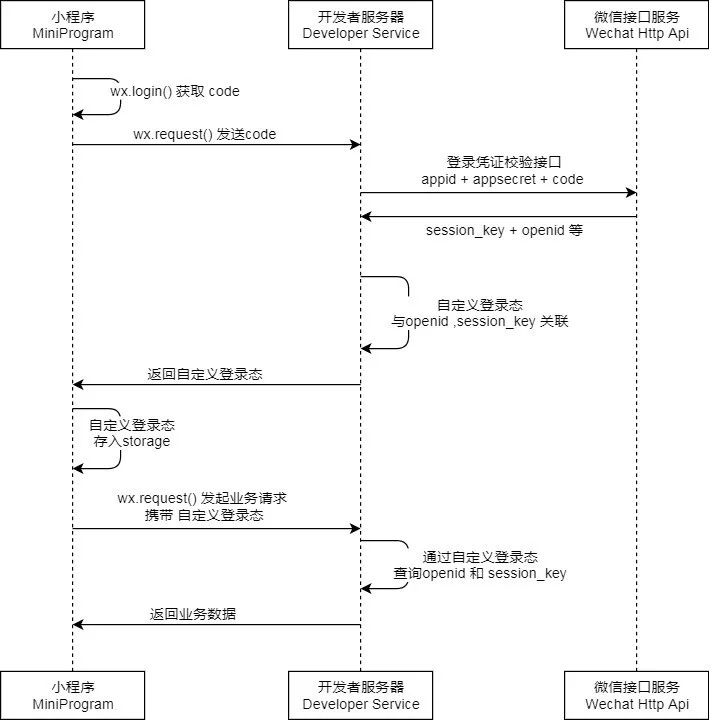
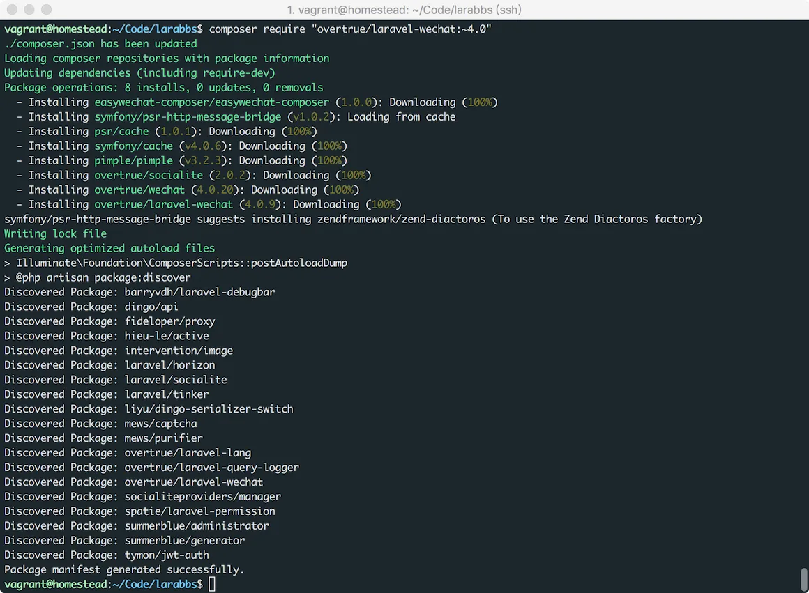
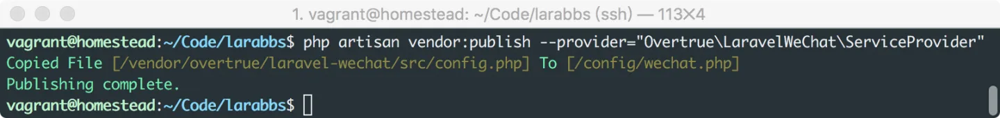
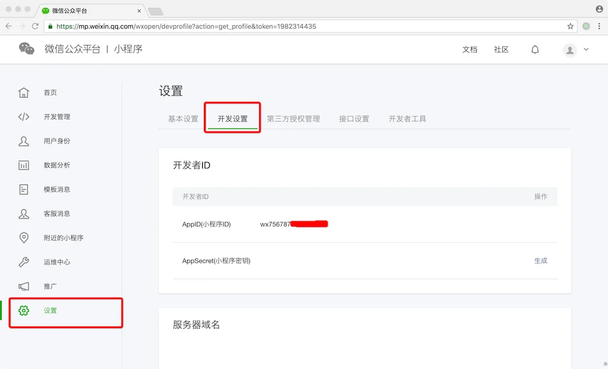
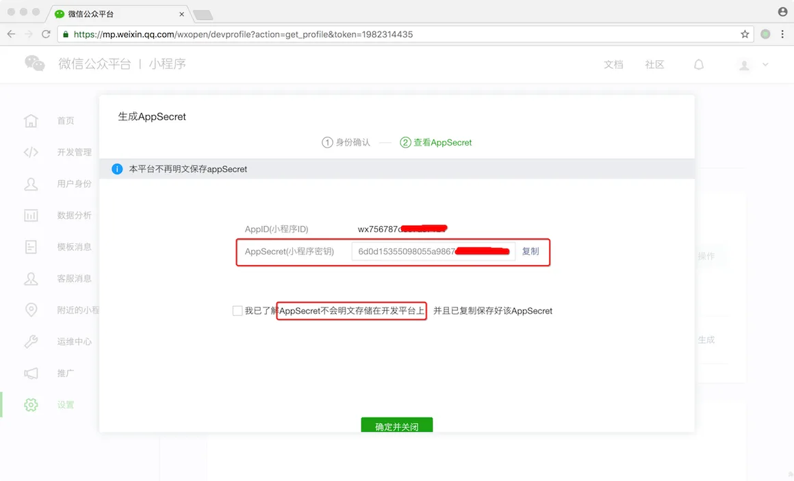
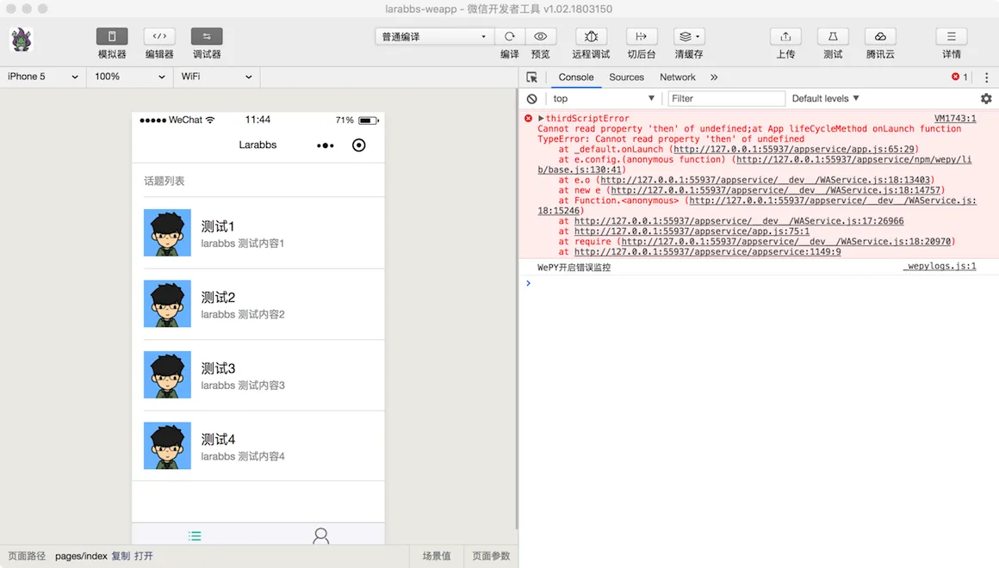
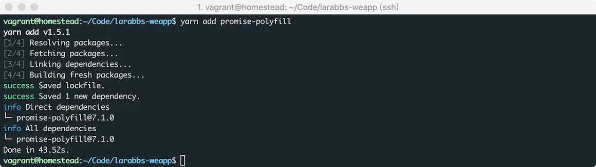
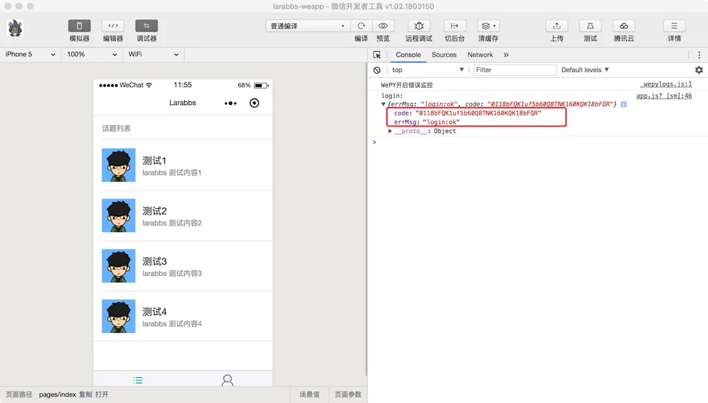
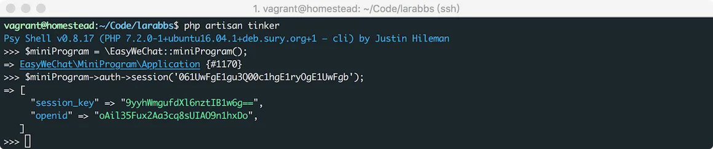

# 4.1. 小程序登录详解

原文链接：https://learnku.com/courses/laravel-weapp/1.7/small-program-login-detailed-solution/1461

本教程最新版为 [2.1](https://learnku.com/courses/laravel-weapp/2.1)，当前版本已放弃维护，请阅读最新版本！

## 小程序登录

这一节我们来详细讲解小程序的登录流程。

## 流程分析

先来看一下微信提供的时序图：



大概看一下流程，很容易想到 OAuth 2.0 的授权码模式，只是稍有区别，结合 LaraBBS 来分析一下流程：

1. 小程序调用 `wx.login()` 接口获取临时登录凭证（code），这一步用户是无感知的，无需用户授权；

2. 小程序提交 `code` 到 LaraBBS 服务器；

3. LaraBBS 服务器通过 `appid`、`appsecret` 和 `code` 请求微信接口，换取用户的 `session_key` 和 `openid`；

4. LaraBBS 服务器根据 `openid` 查找到对应的用户，存入 `session_key`，然后为该用户生成 `access_token` （JWT）返回给小程序。

5. 有了 `access_token` 小程序就可以调用 `发布话题`，`发布回复`，`修改个人信息` 等需要身份认证的接口了。

>

注意这里的 `session_key` 是一个比较特殊的设计，是用户的 `会话密钥`，需要存储在服务器中，调用 `获取用户信息`、`获取微信用户绑定的手机号` 等微信接口时，需要用这个 `会话密钥` 才能解密获取相关数据。每次调用 `wx.login()` 之后，微信都会自动生成新的 `session_key` ，导致之前的 `session_key` 失效，所以在必要的时候再去调用 `wx.login()`，而且还要及时保存 `session_key` 到服务器，以备后续使用。

## 代码调试

### 安装 EasyWeChat

回到 `LaraBBS` 项目中，我们需要调用微信的接口，加密解密微信接口数据，为了加快开发，我们使用 [EasyWeChat](https://github.com/overtrue/wechat) 进行开发，`EasyWeChat` 已经封装好了微信相关的接口，非常方便使用，本教程我们只使用其中小程序的部分。

可以直接使用 EasyWeChat Laravel 5 的拓展包: [overtrue/laravel-wechat](https://github.com/overtrue/laravel-wechat)。

```
$ cd ~/Code/larabbs
$ composer require "overtrue/laravel-wechat:~5.0"
```



### 配置

发布配置文件：

```
$ php artisan vendor:publish --provider="Overtrue\LaravelWeChat\ServiceProvider"
```



修改配置文件，将小程序部分的注释打开：

`config/wechat.php`

```
.
.
.
/*
* 小程序
*/
'mini_program' => [
'default' => [
'app_id'  => env('WECHAT_MINI_PROGRAM_APPID', ''),
'secret'  => env('WECHAT_MINI_PROGRAM_SECRET', ''),
'token'   => env('WECHAT_MINI_PROGRAM_TOKEN', ''),
'aes_key' => env('WECHAT_MINI_PROGRAM_AES_KEY', ''),
],
],
.
.
.
```

登录 [微信公众平台](https://mp.weixin.qq.com/)，找到小程序 `AppID` 和 `AppSecret`，点击后面的 `生成` 按钮：



可以创建一个 `AppSecret`：



打开 .env 设置小程序的 `AppID` 和 `AppSecret`：

.env

```
.
.
.
# 小程序
WECHAT_MINI_PROGRAM_APPID=wx756787de07****
WECHAT_MINI_PROGRAM_SECRET=bb28893cc9cdb3e0f*********
```

### 小程序获取 Code

在小程序中调用 `wepy.login()` 接口，获取 `Code`，根据 WePY 的例子我们添加如下代码。

src/app.wpy

```
.
.
.
onLaunch() {
wepy.login().then(res => {
console.log('login: ', res)
})
}
.
.
.
```

>

由于我们使用了 WePY 框架，所有小程序的接口都需要使用 `wepy` 对象调用，例如 `wx.login()` 就需要使用 `wepy.login()`。

上面代码中的 `wepy.login().then` 使用了 ES6 中的 [Promise](http://es6.ruanyifeng.com/#docs/promise)，它是异步编程的一种解决方案，这里只是测试代码，大家有个概念即可，因为后面的课程中我们会更多的使用 ES7 的新特性 `Async/Await`，后面的课程中会讲到。

打开开发者工具调试，发现报错了：



在 WePY 的文档中找到了 [答案](https://github.com/Tencent/wepy/wiki/wepy%E9%A1%B9%E7%9B%AE%E4%B8%AD%E4%BD%BF%E7%94%A8Promise)，项目中要使用 Promise 需要安装 `promise-polyfill`。

```
$ cd ~/Code/larabbs-weapp
$ yarn add promise-polyfill
```



增加 `this.use('promisify');` 使 API promise 化：

src/app.wpy

```
.
.
.
constructor () {
super()
this.use('requestfix')
this.use('promisify')
}
.
.
.
```

再次打开开发者工具调试：


获取成功，可以看到日志中的 `code` 信息。

### 服务器获取 OpenID

打开 `tinker` 进行调试：

```
$ cd ~/Code/larabbs
$ php artisan tinker
```

输入如下代码，注意替换代码中的 `CODE` 为你真实获取到的 `code`。

```
$miniProgram = \EasyWeChat::miniProgram();
$miniProgram->auth->session('CODE');
```



### 获取 UnionID

获取到的信息中并没有 `unionid` 数据，因为小程序的 `unionid` 需要一些条件才会返回：

- 如果开发者帐号下存在同主体的公众号，并且该用户已经关注了该公众号。开发者可以直接通过 `wx.login` 获取到该用户 `UnionID`，无须用户再次授权。

- 如果开发者帐号下存在同主体的公众号或移动应用，并且该用户已经授权登录过该公众号或移动应用。开发者也可以直接通过 `wx.login` 获取到该用户 `UnionID`，无须用户再次授权。

由于我们没有公众号或移动应用，不方便模拟该情况，后面的课程中会直接使用 `openid`。

结合小程序 `unionid` 的一些限制条件，分析一下 LaraBBS 现有业务:

1. LaraBBS 首先是一个网站，已有用户已通过邮箱或手机创建了账号；

2. LaraBBS 已经也有了接口，可能对接了 APP 或桌面应用，用户可以通过 `手机号` 和 `手机微信` 登录。

本教程是在为一个已经存在用户的应用开发小程序，要考虑已有用户在小程序中依然可以使用相同的账户，所以本教程中的账号体系为：

1. 根据用户 openid 查找系统中用户；

2. 未找到对应用户，要求用户输入已有账号用户名密码登录；

3. 如果用户是新用户，可以跳转到注册页面进行注册；

4. 无论登录还是注册，都会将用户与当前小程序 `openid` 进行绑定，用户下次进入小程序无需再次登录。

## 代码版本控制

### larabbs

```
$ cd ~/Code/larabbs
$ git add -A
$ git commit -m 'add easywechat'
```

### larabbs-weapp

```
$ cd ~/Code/larabbs-weapp
$ git add -A
$ git commit -m 'wepy login'
```
