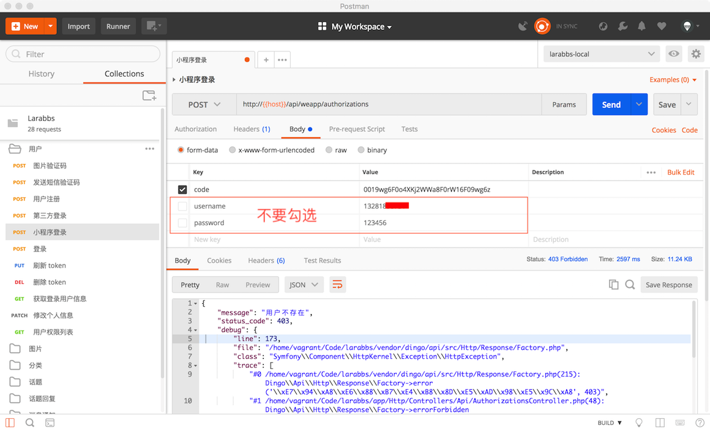
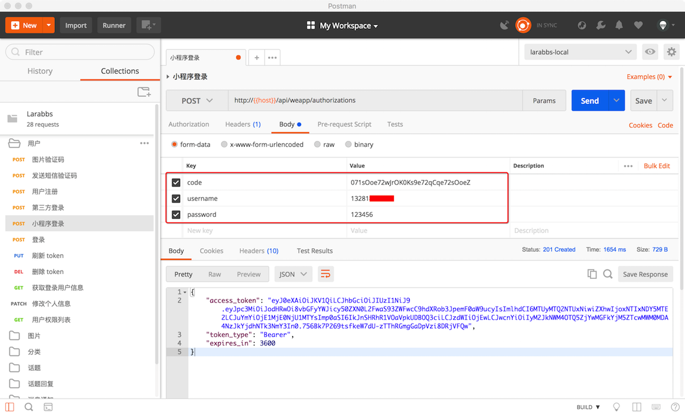
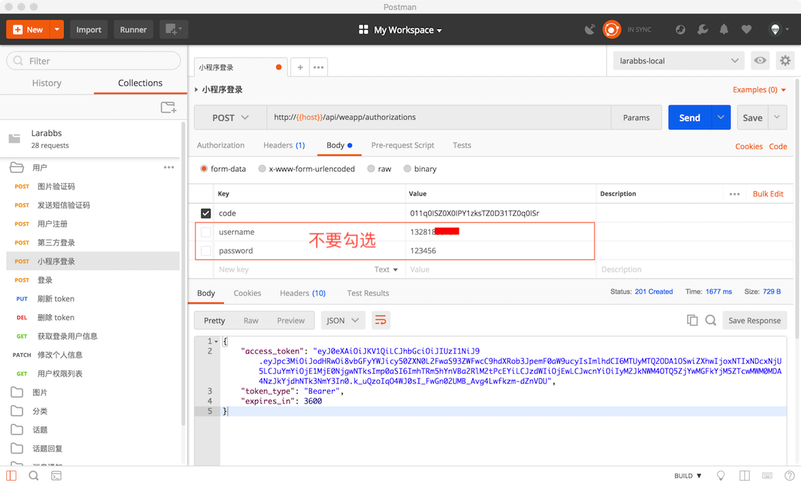

# 4.2. 扩展 Larabbs 登录接口

原文链接：https://learnku.com/courses/laravel-weapp/1.7/small-program-login-interface/1483

本教程最新版为 [2.1](https://learnku.com/courses/laravel-weapp/2.1)，当前版本已放弃维护，请阅读最新版本！

## Larabbs 登录接口

这一节我们来实现 Larabbs 中小程序的登录接口。Larabbs 已有的用户体系中，用户可以使用 `邮箱` 登录，在 [第三本教程](https://learnku.com/courses/laravel-advance-training/5.5) 中，我们增加了 `手机注册` 和 `微信登录` 的接口，所以目前为止 Larabbs 可以使用：

- `邮箱`

- `手机`

- `微信登录`

三种方式进行登录。正如上一小节里提到过的，如果公众平台绑定了微信其他应用以及小程序，那么利用 UnionId 就可以获取到唯一的一个微信用户，但是由于我们并没有真实的微信手机应用或网页应用，所以暂不展开讨论。

>

如果你不想进行小程序服务端的开发，可以切换 larabs 到 weapp 这个分支，这里有所有的代码。如果你是从第三本教程开始学习的，建议大家可以跟着一起修改一下。

小程序登录的场景为：

1. 未能根据小程序的 `openid` 找到绑定的用户，则跳转到登录页面，让用户输入用户名（邮箱或手机）及密码，然后将用户与小程序 `openid` 绑定，返回 access_token，登录成功。

2. 可以根据小程序的 `openid` 找到绑定的用户，直接返回 access_token，登录成功。

## 修改表结构

通过 code，我们最终从微信服务器获取了用户的 `session_key` 和 `openid`。我们需要将 `session_key` 保存在数据库中，以便之后的接口使用，同时我们还需要增加 `weapp_openid` 用于记录小程序的 `openid`。

```
$ cd ~/Code/larabbs
$ php artisan make:migration add_weixin_session_key_to_users_table --table=users
```

修改 migration 文件，注意替换文件路径中的 `your_date` 。
database/migrations/< your_date >add_weixin_session_key_to_users_table.php

```
<?php

use Illuminate\Support\Facades\Schema;
use Illuminate\Database\Schema\Blueprint;
use Illuminate\Database\Migrations\Migration;

class AddWeixinSessionKeyToUsersTable extends Migration
{
/**
* Run the migrations.
*
* @return void
*/
public function up()
{
Schema::table('users', function (Blueprint $table) {
$table->string('weapp_openid')->nullable()->unique()->after('weixin_openid');
$table->string('weixin_session_key')->nullable()->after('weapp_openid');
});
}

/**
* Reverse the migrations.
*
* @return void
*/
public function down()
{
Schema::table('users', function (Blueprint $table) {
$table->dropColumn('weapp_openid');
$table->dropColumn('weixin_session_key');
});
}
}
```

执行迁移：

```
$ php artisan migrate
```

## Larabbs 增加登录接口

### 增加路由

小程序是通过微信的临时授权码（code）登录，为了与 `larabbs` 中的登录接口区分开，我们新增加一个路由：

routes/api.php

```
.
.
.
// 登录
$api->post('authorizations', 'AuthorizationsController@store')
->name('api.authorizations.store');
// 小程序登录
$api->post('weapp/authorizations', 'AuthorizationsController@weappStore')
->name('api.weapp.authorizations.store');
.
.
.
```

### 增加 Request

创建 WeappAuthorizationRequest：

```
$ php artisan make:request Api/WeappAuthorizationRequest
```

修改如下：

app/Http/Requests/Api/WeappAuthorizationRequest.php

```
<?php

namespace App\Http\Requests\Api;

class WeappAuthorizationRequest extends FormRequest
{
/**
* Get the validation rules that apply to the request.
*
* @return array
*/
public function rules()
{
return [
'code' => 'required|string',
];
}
}
```

### 修改 Controller

app/Http/Controllers/Api/AuthorizationsController.php

```
.
.
.
use App\Http\Requests\Api\WeappAuthorizationRequest;
.
.
.
public function weappStore(WeappAuthorizationRequest $request)
{
$code = $request->code;

// 根据 code 获取微信 openid 和 session_key
$miniProgram = \EasyWeChat::miniProgram();
$data = $miniProgram->auth->session($code);

// 如果结果错误，说明 code 已过期或不正确，返回 401 错误
if (isset($data['errcode'])) {
return $this->response->errorUnauthorized('code 不正确');
}

// 找到 openid 对应的用户
$user = User::where('weapp_openid', $data['openid'])->first();

$attributes['weixin_session_key'] = $data['session_key'];

// 未找到对应用户则需要提交用户名密码进行用户绑定
if (!$user) {
// 如果未提交用户名密码，403 错误提示
if (!$request->username) {
return $this->response->errorForbidden('用户不存在');
}

$username = $request->username;

// 用户名可以是邮箱或电话
filter_var($username, FILTER_VALIDATE_EMAIL) ?
$credentials['email'] = $username :
$credentials['phone'] = $username;

$credentials['password'] = $request->password;

// 验证用户名和密码是否正确
if (!Auth::guard('api')->once($credentials)) {
return $this->response->errorUnauthorized('用户名或密码错误');
}

// 获取对应的用户
$user = Auth::guard('api')->getUser();
$attributes['weapp_openid'] = $data['openid'];
}

// 更新用户数据
$user->update($attributes);

// 为对应用户创建 JWT
$token = Auth::guard('api')->fromUser($user);

return $this->respondWithToken($token)->setStatusCode(201);
}
.
.
.
```

分析一下逻辑：

- 根据客户端提交的 `code`，获取小程序 `openid`；

- 如果未找到对应的用户，则抛出 403 错误，小程序可根据报错跳转到登陆页面；

- 如果小程序提交了 `code` 及用户名密码后，验证用户名密码后，为用户绑定 `openid`；

- 如果根据 `openid` 找到对用的用户，则只更新 `session_key`；

>

注意 session_key 是用于解密微信的手机以及用户信息等接口数据的秘钥，虽然本教程不涉及相关内容，但是依然需要及时更新。

修改 User 模型 `fillable` 增加 `weixin_session_key` 和 `weapp_openid`。

app\Models\User.php

```
.
.
.
protected $fillable = [
'name', 'phone', 'email', 'password', 'introduction', 'avatar',
'weixin_openid', 'weixin_unionid', 'registration_id',
'weixin_session_key', 'weapp_openid',
];
.
.
.
```

### 使用 PostMan 调试

1.

没有用户绑定小程序——openid 没有找到对应的用户

不要勾选 `username` 和 `password` 只提交 `code`。


>

特别要注意的是，`code` 只能使用一次，请求过一次之后需要重新去开发者工具中获取一个 `code`。

2.

没有用户绑定小程序，提交了用户名和密码，进行账户绑定



3.

用户已经绑定小程序



## 代码版本控制

```
$ cd ~/Code/larabbs
$ git add -A
$ git commit -m 'weapp login'
```
