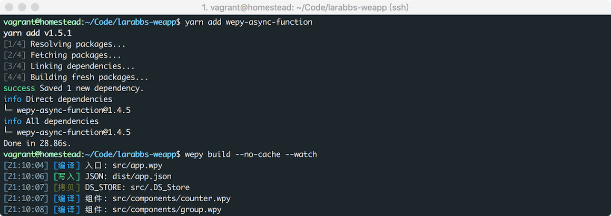
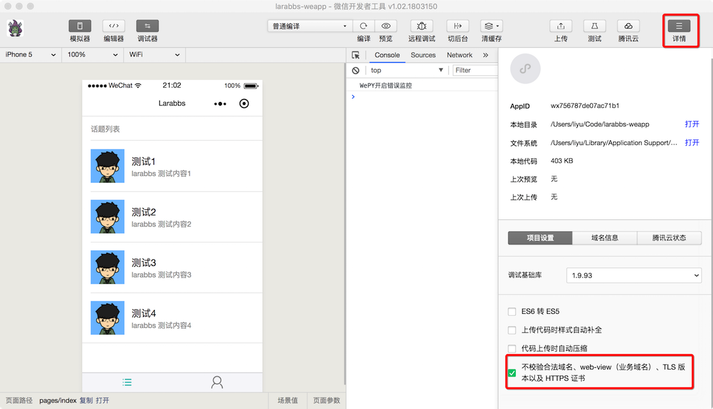
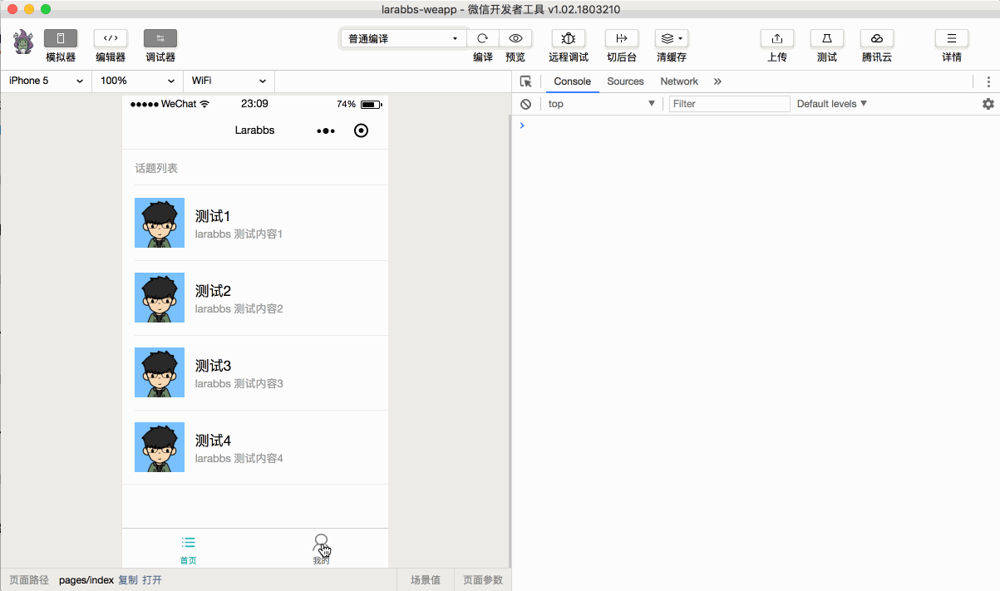
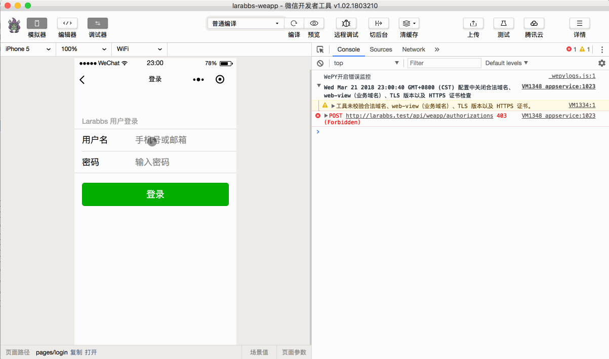
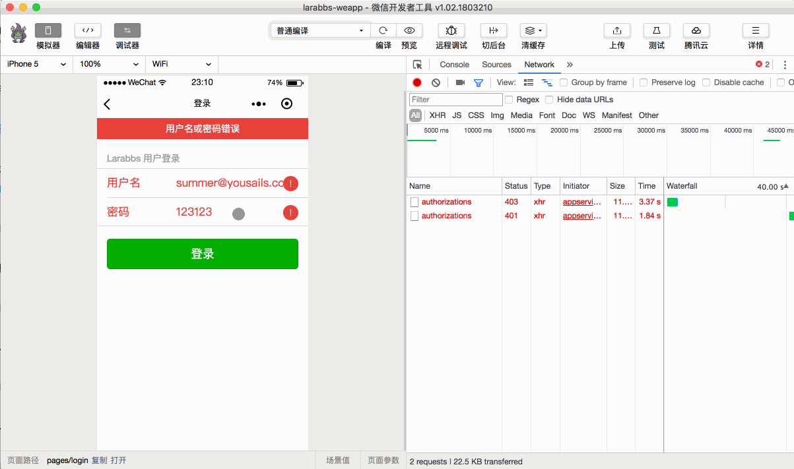
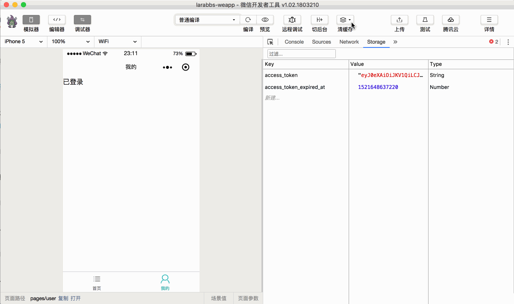

# 4.3. 小程序登录页面

原文链接：https://learnku.com/courses/laravel-weapp/1.7/binding-an-existing-account/1462

本教程最新版为 [2.1](https://learnku.com/courses/laravel-weapp/2.1)，当前版本已放弃维护，请阅读最新版本！

## 小程序登录页面

这一节我们来实现小程序登录功能。LaraBBS 是一个论坛类应用，用户角色分为 `游客` 和 `登录用户`，`游客` 可以正常的浏览话题列表，浏览话题回复，切换各种分类下的话题。涉及到 `发布话题`，`发布回复`，`修改个人信息` 等操作时，才需要用户登录。小程序的产品体验应当与 LaraBBS 一致。

## 支持 Async/Await

[Async/Await](http://es6.ruanyifeng.com/#docs/async) 是 ES7 的新特性，得益于 [Babel](https://babeljs.cn/) 我们可以提前使用该特性，Babel 是一个广泛使用的转码器，可以将代码转为 ES5 代码，简单的解释就是将高版本的代码转换为低版本，从而在低版本环境中执行。

为了理解 `Async/Await` 举个简单的例子：

`wepy.login()` 是微信提供的接口，用于获取临时登录凭证 `Code`，这是个异步的调用，原生小程序开发需要定义 `success` 回调方法：

```
onLaunch() {
// 原生小程序开发
wx.login({
success: function(res) {
console.log(res)
}
});
}
```

在 WePY 中我们可以使用 `Promise`，进一步简化了代码，可以采用链式写法：

```
onLaunch() {
// WePY 中使用 Promise
wepy.login().then(res => {
console.log('login: ', res)
})
}
```

有了 `Await` 后我们发现代码变成了一行，只需要在异步调用前增加  `await`，就可以用同步的方式处理异步代码了，增加了代码的可读性，方便理解和使用：

```
async onLaunch() {
// WePY 中使用 Await
let res = await wepy.login()
}
```

大家可以先有个基本概念，随着课程实践，会对 `Async/Await` 有更加深入的理解。

>

需要注意的是如果方法中使用了 `await` 那么方法前必须增加 `async` 关键字。

为了在 WePY 中使用 `async/await`，我们需要手动安装 `wepy-async-function`，框架的 [文档](https://github.com/Tencent/wepy/wiki/wepy%E9%A1%B9%E7%9B%AE%E4%B8%AD%E4%BD%BF%E7%94%A8async-await) 中有具体说明。

```
$ cd ~/Code/larabbs-weapp
$ yarn add wepy-async-function
```

在 `app.wpy` 中引入引入 `wepy-async-function`，同时删除上一节的测试代码：

app.wpy

```
.
.
.
import wepy from 'wepy'
import 'wepy-async-function'
.
.
.
onLaunch() {
}
.
.
.
```

重新编译并监听

```
$ wepy build --no-cache --watch
```



## 创建登录页面

首先需要手动创建一个登录页面 `login.wpy`，根据功能区分，放在 `pages/auth` 目录中。

```
$ cd ~/Code/larabbs-weapp
$ mkdir src/pages/auth
$ touch src/pages/auth/login.wpy
```

不要忘记小程序中所有页面都必须配置在 `app.wpy` 中的 `pages` 选项中才可以使用：

src/app.wpy

```
.
.
.
config = {
pages: [
'pages/index',
'pages/user',
'pages/auth/login'
],
.
.
.
```

## 封装接口请求

我们可以对小程序提供的网络请求进行一次封装，例如每个网络请求都能在请求开始前，显示 `Loading` 加载提示，请求结束后取消加载提示，方便之后其他地方调用。可以新建一个 `untils` 目录，在这个目录中放我们封装的工具文件。

```
$ mkdir src/utils
```

在 `untils` 工具目录中，新增一个 `api.js` 文件，将后端接口请求相关的代码封装在该文件中，接下来的课程会继续将 `刷新 Token`，`退出登录`，`上传文件` 等逻辑封装在该文件中。

```
$ touch src/utils/api.js
```

修改文件如下：

src/utils/api.js

```
import wepy from 'wepy'

// 服务器接口地址
const host = 'http://larabbs.test/api'

// 普通请求
const request = async (options, showLoading = true) => {
// 简化开发，如果传入字符串则转换成 对象
if (typeof options === 'string') {
options = {
url: options
}
}
// 显示加载中
if (showLoading) {
wepy.showLoading({title: '加载中'})
}
// 拼接请求地址
options.url = host + '/' + options.url
// 调用小程序的 request 方法
let response = await wepy.request(options)

if (showLoading) {
// 隐藏加载中
wepy.hideLoading()
}

// 服务器异常后给与提示
if (response.statusCode === 500) {
wepy.showModal({
title: '提示',
content: '服务器错误，请联系管理员或重试'
})
}
return response
}

// 登录
const login = async (params = {}) => {
// code 只能使用一次，所以每次单独调用
let loginData = await wepy.login()

// 参数中增加code
params.code = loginData.code

// 接口请求 weapp/authorizations
let authResponse = await request({
url: 'weapp/authorizations',
data: params,
method: 'POST'
})

// 登录成功，记录 token 信息
if (authResponse.statusCode === 201) {
wepy.setStorageSync('access_token', authResponse.data.access_token)
wepy.setStorageSync('access_token_expired_at', new Date().getTime() + authResponse.data.expires_in * 1000)
}

return authResponse
}

export default {
request,
login
}

```

上面的代码中用到了以下几个小程序接口：

- wepy.showLoading——显示加载框；

- wepy.hideLoading——与 `showLoading` 对应，隐藏加载框，注意应该成对出现；

- [wepy.setStorageSync](https://developers.weixin.qq.com/miniprogram/dev/api/data.html)——设置缓存中的某个数据; 与之对应的是 `getStorageSync` ，获取缓存中的某个数据；

- wepy.showModal——显示一个模态框。

- wepy.request——发起网络请求，参数主要包括：

- url——接口地址；

- data——请求的参数；

- header——请求的 header；

- method——请求的方法，有效值：OPTIONS，GET，HEAD，POST，PUT，DELETE，TRACE，CONNECT。

这里封装了两个方法，`request` 和 `login`，注意这里使用了 ES6 中的 [箭头函数](http://es6.ruanyifeng.com/#docs/function%23%E7%AE%AD%E5%A4%B4%E5%87%BD%E6%95%B0) 来定义方法，分析一下代码逻辑：

1.

首先使用 `const` 定义了一个常量 `const host = 'http://larabbs.test/api'`，对应后端的接口地址；

2.

封装了 `request` 方法，主要是对框架提供的 `request` 方法的封装，默认在请求之前显示加载中，如果接口返回 500 则给出错误提示等；

3.

封装了 `login` 方法，主要是是对登录逻辑的封装，如果登录成功，则将 `access_token` 和过期时间存入 `storage` 中。

小程序网络请求的结果 `authResponse` 主要结构如下：

- data —— 接口响应数据，包含 `access_token`，`expires_in`，`token_type`；

- header —— 接口响应的header 数据；

-

statusCode —— 接口响应状态码，判断接口是否调用成功；

观察对象结构，你会发现 `authResponse.data` 对应着接口的响应数据，通过  `authResponse.data.access_token` 才能拿到接口返回的 `access_token`。因为 Token 相关的数据是全局共用，长期有效的数据，所以存放在数据缓存 （ Storage ） 中非常合适，通过 `getStorageSync` 即可获取到数据。

4.

最后我们使用 `export default` 抛出了定义的这两个方法，这样只需要 `import api from '@/utils/api'` 引入 `api.js` 文件后，就可以通过 `api.request` 和 `api.login` 来调用方法了。

## 修改登录页面

打开登录页面，填入如下内容：

src/pages/auth/login.wpy

```
<style lang="less">
.login-wrap {
margin-top: 50px;
}
</style>
<template>
<view class="page">
<view class="page__bd login-wrap">
<view class="weui-toptips weui-toptips_warn" wx:if="{{ errorMessage }}">{{ errorMessage }}</view>

<view class="weui-cells__title">Larabbs 用户登录</view>
<view class="weui-cells weui-cells_after-title">
<view class="weui-cell weui-cell_input {{ error ? 'weui-cell_warn' : ''}}">
<view class="weui-cell__hd">
<view class="weui-label">用户名</view>
</view>
<view class="weui-cell__bd">
<input class="weui-input" placeholder="手机号或邮箱" @input="bindUsernameInput" />
</view>
<view wx:if="{{ error }}" class="weui-cell__ft">
<icon type="warn" size="23" color="#E64340"></icon>
</view>
</view>
<view class="weui-cell weui-cell_input {{ error ? 'weui-cell_warn' : ''}}">
<view class="weui-cell__hd">
<view class="weui-label">密码</view>
</view>
<view class="weui-cell__bd">
<input class="weui-input" placeholder="输入密码" type="password" @input="bindPasswordInput" />
</view>
<view wx:if="{{ error }}" class="weui-cell__ft">
<icon type="warn" size="23" color="#E64340"></icon>
</view>
</view>
</view>

<view class="weui-btn-area">
<button class="weui-btn" type="primary" @tap="submit">登录</button>
</view>
</view>
</view>
</template>

<script>
import wepy from 'wepy'
import api from '@/utils/api'

export default class Login extends wepy.page {
config = {
navigationBarTitleText: '登录'
}
data = {
// 用户名
username: '',
// 密码
password: '',
// 是否有错
error: false,
// 错误信息
errorMessage: ''
}
methods = {
// 绑定用户名 input 变化
bindUsernameInput (e) {
this.username = e.detail.value
},
// 绑定密码 input 变化
bindPasswordInput (e) {
this.password = e.detail.value
},
// 表单提交
async submit() {
// 提交时重置错误
this.error = false
this.errorMessage = ''

if (!this.username || !this.password) {
this.errorMessage = '请填写账户名和密码'
return
}

// 获取用户名和密码
let params = {
username: this.username,
password: this.password
}

try {
let authResponse = await api.login(params)

// 请求结果为 401 说明用户名和密码错误，显示错误提示
if (authResponse.statusCode === 401) {
this.error = true
this.errorMessage = authResponse.data.message
this.$apply()
}

// 201 为登录正确，返回上一页
if (authResponse.statusCode === 201) {
wepy.navigateBack()
}
} catch (err) {
wepy.showModal({
title: '提示',
content: '服务器错误，请联系管理员'
})
}
}
}
// 页面打开事件
async onShow() {
try {
// 打开页面自动调用一次登录
let authResponse = await api.login()

// 登录成功返回上一页
if (authResponse.statusCode === 201) {
wepy.navigateBack()
}
} catch (err) {
wepy.showModal({
title: '提示',
content: '服务器错误，请联系管理员'
})
}
}
}
</script>

```

在文件中我们添加了很多内容，如果你之前没有了解过 Vue 或者 MVVM，可能会有点陌生，不必担心，我们一点一点分析一下代码，随着后面的使用，你会有更深入的认识。

### 模板代码

模板中需要学习以下几个新的知识点：

1. [wx:if](https://developers.weixin.qq.com/miniprogram/dev/framework/view/wxml/conditional.html) ——小程序提供的标签控制属性，`wx:if="{{ error }}"` 当 `data` 中定义的 `error` 值为 True 时才会显示整个代码块；

2. @input —— 输入框输入事件，@ 符号是 WePY 为我们提供的事件修饰符，相比原生小程序开发的 `bindinput="bindUsernameInput"` 要更加简便。 `@input="bindUsernameInput"` 表示当数据框输入时，便会调用 methods 中定义的 `bindUsernameInput` 方法；

3. @tap —— 手指触摸后离开事件。

模板内容很简单，两个输入框，用户名和密码，用户输入后点击 `登录` 按钮，因为绑定了 `@tap="submit"`，用户点击过后调用 `submit` 方法，执行登录的逻辑。

### JS 交互逻辑

首先来看一下代码结构：

```
export default class Login extends wepy.page {
config = {}
data = {}
methods = {
bindUsernameInput (e) {}
bindPasswordInput (e) {}
async submit() {}
}
async onShow() {}
}
```

- config —— 页面配置，我们在其中增加了 [navigationBarTitleText](https://developers.weixin.qq.com/miniprogram/dev/framework/config.html) 配置，是导航栏标题文字内容，每个页面都可单独定义，这里我们显示为 `登录`。如果不定义则显示 `src/app.wpy` 中定义的 `window.navigationBarTitleText` 显示为 `LaraBBS`；

- data —— 模板中需要数据绑定的数据，定义了用户名（username）和密码（password），以及错误信息 `errors` 和 `errorMessage`；

- methods —— 绑定的事件处理函数，所有的 `事件处理函数`，必须定义在 `methods` 对象中；

- bindUsernameInput —— 绑定的用户输入用户名的处理函数，赋值给 `username`；

- bindPasswordInput —— 绑定用户输入密码的处理函数，赋值给 `password`；

- submit —— 用户点击登录处理函数。

- onShow ——小程序生命周期函数。

用户打开登录页面后，便会触发 onShow 方法，这里需要了解一下小程序页面的生命周期函数：

>

onLoad: 页面加载 —— 一个页面只会调用一次；

onShow: 页面显示——每次打开页面都会调用一次；

onReady: 页面初次渲染完成——一个页面只会调用一次，代表页面已经准备妥当，可以和视图层进行交互；

onHide: 页面隐藏——当 navigateTo 或底部 tab 切换时调用；

onUnload: 页面卸载——当 redirectTo 或 navigateBack 的时候调用。

在 `onShow` 方法中调用一次我们封装的登录逻辑 `api.login()`，如果找到微信 openid 对应的用户，则保存 Token，调用 `navigateBack()` 返回之前的页面。

如果用户还未绑定用户，则输入用户名和密码，点击登录，执行 `submit` 方法分析：

1. 如果用户名或者密码未输入完整，则提示错误信息 `请填写账户名和密码`；

2. 用户输入用户名和密码后，点击提交后，调用小程序登录接口；

3. 用户名密码错误时接口返回 401，提示用户用户名或密码错误；

4.

登录成功返回 201 后，返回之前的页面。

WePY 让我们可以直接使用简化了的数据绑定方式，直接使用 `this.error = true` 就可以更新 data 中的数据，如果使用原生的开发方式我们必须使用 `setData` 方法。但是注意 在异步函数中更新数据的时候，必须手动调用 `this.$apply()` 方法，才会触发脏数据检查流程的运行，也就是存在异步调用的方法中，要更新 data 中某个数据时必须调用一次 `this.$apply()`。

还需要注意的是，涉及到异步处理，例如网络请求的时候，增加 `try/catch` 会让你的代码更加安全，比如调用 `登录接口` 时我们就使用了下面的结构：

```
try {
.
.
.
} catch (err) {
wepy.showModal({
title: '提示',
content: '服务器错误，请联系管理员'
})
}
```

有任何的异常便会调用 `wepy.showModal` 方法提示 `服务器错误，请联系管理员`。

## 修改我的页面

src/pages/user.wpy

```
<template>
<view class="page">
<view wx:if="{{ loggedIn }}">
已登录
</view>
<view wx:else>
<navigator class="weui-cell weui-cell_access" url="/pages/auth/login">
<view class="weui-cell__bd">未登录</view>
<view class="weui-cell__ft weui-cell__ft_in-access"></view>
</navigator>
</view>
</view>
</template>

<script>
import wepy from 'wepy'

export default class User extends wepy.page {
config = {
navigationBarTitleText: '我的'
}
data = {
loggedIn: false
}
onShow() {
if (wepy.getStorageSync('access_token')) {
this.loggedIn = true
}
}
}
</script>

```

代码逻辑很简单，我们将 `login` 页面的链接放在 `我的` 页面中，`onShow` 的时候，也就是切换到 `我的` 页面时，判断 `storage` 中是否已经存在 `access_token`，来显示用户是否已经登录。

## 开发者工具调试

在调试之前，我们先将开发者工具的 `不校验合法域名、web-view（业务域名）、TLS 版本以及 HTTPS 证书` 选项打开，这样我们就能使用本地的非 `https` 域名进行调试。



1. 小程序未绑定用户，跳转到登录页面：



1. 输入错误的 `用户名` 和 `密码`，提示用户名密码错误：



1. 在 [larabbs.test](http://larabbs.test) 中注册或者找到一个已存在的用户，正确输入用户的 `用户名` 和 `密码`，登录成功，跳转回我的页面：



1. 清除缓存，再次点击登录，直接登录成功，跳转回我的页面：



## 代码版本控制

```
$ cd ~/Code/larabbs-weapp
$ git add -A
$ git commit -m 'page login'
```
