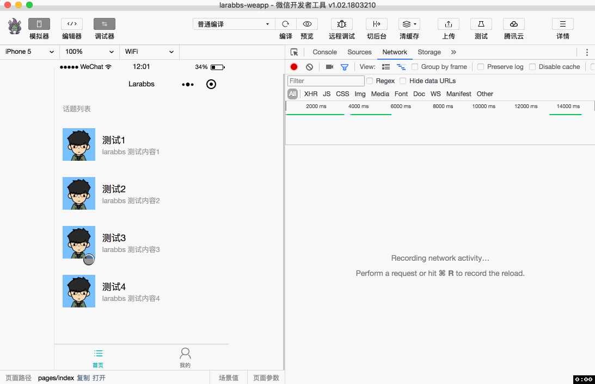
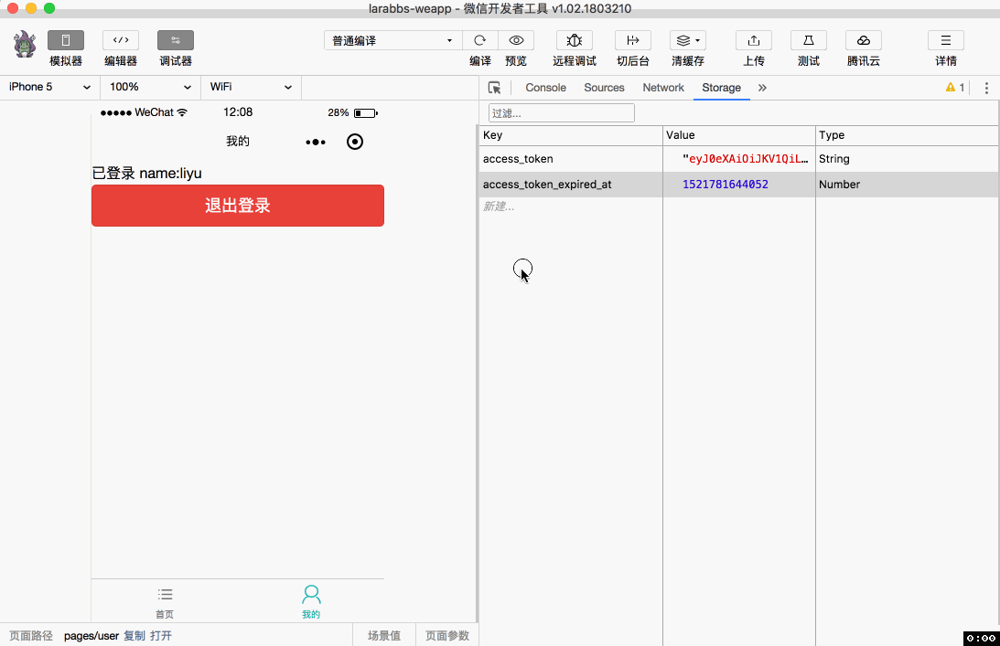

# 4.4. 维持登录状态

原文链接：https://learnku.com/courses/laravel-weapp/1.7/maintain-logon-status/1463

本教程最新版为 [2.1](https://learnku.com/courses/laravel-weapp/2.1)，当前版本已放弃维护，请阅读最新版本！

## 维持登录状态

这一节我们将学习如何维持小程序登录的状态，已经能够正确登录，调用登录接口获取 JWT，并保存在小程序缓存中。但是出于安全考虑 JWT 的有效时间一般不会太长，默认的时间为 1 小时，过期之后则无法请求需要身份认证的接口。

既然用户已经登录成功，说明小程序 `openid` 已经绑定了 Larabbs 用户，直接调用 `api.login` 即可重新获取一个 JWT，所以你可能第一时间会想到，如果发现 JWT 过期，则直接重新登录，调用 `api.login`。

但是重新登录会产生以下流程：

1. 小程序重新调用微信服务器 `wepy.login` 获取 `code`，微信服务器使现有 `session_key` 失效，重新生成 `session_key`;

2. 小程序调用 LaraBBS 服务器登录接口，提交 `code`;

3. LaraBBS 服务器去微信服务器换取 `openid` 及 `session_key`，根据 `openid` 找到用户，保存 `session_key`；

4. 返回新的 JWT。

整个过程中产生了几次网络请求，因为调用了 wepy.login()，导致 `session_key` 被微信重置，虽然达到了维持登录状态的目的，但是并不是很完美。还记得我们有 `刷新接口Token` 接口吗，其实只需要一次网络请求，通过旧 Token 换取一个新的 Token 即可。

## 刷新 Token

首先在 `src/utils/api.js` 中封装一个刷新 `Token` 的方法 `refreshToken`：

src/utils/api.js

```
.
.
.
// 刷新 Token
const refreshToken = async (accessToken) => {
// 请求刷新接口
let refreshResponse = await wepy.request({
url: host + '/' + 'authorizations/current',
method: 'PUT',
header: {
'Authorization': 'Bearer ' + accessToken
}
})

// 刷新成功状态码为 200
if (refreshResponse.statusCode === 200) {
// 将 Token 及过期时间保存在 storage 中
wepy.setStorageSync('access_token', refreshResponse.data.access_token)
wepy.setStorageSync('access_token_expired_at', new Date().getTime() + refreshResponse.data.expires_in * 1000)
}

return refreshResponse
}
.
.
.
export default {
request,
refreshToken,
login
}
```

逻辑很简单，请求 `刷新Token` 接口，成功后将 `Token` 及 `过期时间` 保存在缓存中。

## 封装 authRequest

我们还希望能有个方法，请求需要身份认证的接口时自动帮我们添加 `Authorization` 头，并自动帮我们处理 Token 的刷新问题，继续封装一个 `authRequest` 方法。

src/utils/api.js

```
.
.
.
// 获取 Token
const getToken = async (options) => {
// 从缓存中取出 Token
let accessToken = wepy.getStorageSync('access_token')
let expiredAt = wepy.getStorageSync('access_token_expired_at')

// 如果 token 过期了，则调用刷新方法
if (accessToken && new Date().getTime() > expiredAt) {
let refreshResponse = await refreshToken(accessToken)

// 刷新成功
if (refreshResponse.statusCode === 200) {
accessToken = refreshResponse.data.access_token
} else {
// 刷新失败了，重新调用登录方法，设置 Token
let authResponse = await login()
if (authResponse.statusCode === 201) {
accessToken = authResponse.data.access_token
}
}
}

return accessToken
}

// 带身份认证的请求
const authRequest = async (options, showLoading = true) => {
if (typeof options === 'string') {
options = {
url: options
}
}
// 获取Token
let accessToken = await getToken()

// 将 Token 设置在 header 中
let header = options.header || {}
header.Authorization = 'Bearer ' + accessToken
options.header = header

return request(options, showLoading)
}
.
.
.
export default {
request,
authRequest,
refreshToken,
login
}
```

我们封装了 `getToken` 方法用于获取可用的 Token：

1. 从缓存中获取 Token；

2. 对比 Token 过期时间，过期了则调用上一步封装的 `refreshToken` 方法；

3. 刷新成功则使用刷新后的新 Token；

4. 刷新失败则可能是由于 Token 长时间未刷新，过了 Token 的可刷新时间，那么则重新调用 `login` 方法；

封装了 `authRequest` 方法，自动给请求增加 `Authorization` 头，然后 调用上一节封装的 `api.request` 发起网络请求。

## 退出登录

当然还需要退出登录方法：

src/utils/api.js

```
.
.
.
//  退出登录
const logout = async (params = {}) => {
let accessToken = wepy.getStorageSync('access_token')
// 调用删除 Token 接口，让 Token 失效
let logoutResponse = await wepy.request({
url: host + '/' + 'authorizations/current',
method: 'DELETE',
header: {
'Authorization': 'Bearer ' + accessToken
}
})

// 调用接口成功则清空缓存
if (logoutResponse.statusCode === 204) {
wepy.clearStorage()
}

return logoutResponse
}
.
.
.
export default {
request,
authRequest,
refreshToken,
login,
logout
}
```

调用 `删除Token` 接口，将当前 `Token` 注销，退出登录成功后调用 `clearStorage` 方法，`clearStorage` 是小程序提供的接口，用来清空缓存数据。

## 修改我的页面

首先修改一下 `我的` 页面，增加一些测试代码：

src/pages/user.wpy

```
<template>
<view class="page">
<view wx:if="{{ loggedIn }}">
已登录 name:{{ userInfo.name }}
<button type="warn" @tap="logout">退出登录</button>
</view>
<view wx:else>
<navigator class="weui-cell weui-cell_access" url="/pages/auth/login">
<view class="weui-cell__bd">未登录</view>
<view class="weui-cell__ft weui-cell__ft_in-access"></view>
</navigator>
</view>
</view>
</template>

<script>
import wepy from 'wepy'
import api from '@/utils/api'

export default class User extends wepy.page {
config = {
navigationBarTitleText: '我的'
}
data = {
// 标记是否登录
loggedIn: false,
// 用户信息
userInfo: null
}
async onShow() {
// 获取缓存中的 access_token
let accessToken = wepy.getStorageSync('access_token')

// Token 存在则说明已登录
if (accessToken) {
// 测试 authRequest 接口
let userResponse = await api.authRequest('user')
this.userInfo = userResponse.data
this.loggedIn = true
this.$apply()
}
}
methods = {
// 退出
async logout (e) {
try {
let logoutResponse = await api.logout()

// 退出成功清除信息
if (logoutResponse.statusCode === 204) {
this.loggedIn = false
this.userInfo = null
this.$apply()
}
} catch (err) {
console.log(err)
wepy.showModal({
title: '提示',
content: '服务器错误，请联系管理员'
})
}
}
}
}
</script>

```

上面的模板中依然使用了 `wx:if`  以及 `wx:else`，不难理解，`wx:if="{{ loggedIn }}"` 当 `loggedIn` 为 `true` 的时候，显示已登录，否则显示未登录。

注意页面中引入 `api.js` 时我们使用 `import api from '@/utils/api'`，@ 是在 `wepy.config.js` 的 `alias` 中已经定义好的：

```
alias: {
counter: path.join(__dirname, 'src/components/counter'),
'@': path.join(__dirname, 'src')
},
```

`@` 是 `src` 目录的别名，使用 `@` 更加方便，而且不会因为文件位置变动而调整代码。

页面显示 `onShow` 的时候，如果用户登录，则使用 `authRequest` 请求 `获取登录用户信息` 接口。同时我们增加了一个按钮，点击后调用 `退出登录` 方法。

## 开发者工具调试

清空缓存信息，点击 `未登录` 跳转到登录页面：



自动登录成功，返回 `我的` 页面，因为在 `onShow` 方法添加了测试代码，所以每次打开 `我的` 页面都会重新获取用户信息，点击退出会清空缓存信息。

下面我们将 Storage 中的 `access_token_expired_at` 设置为 0，模拟 JWT 过期的场景：



可以看到当  JWT 过期后，先调用刷新接口获取新的 Token 之后再请求 `获取登录用户信息` 接口。

## 代码版本控制

```
$ cd ~/Code/larabbs-weapp
$ git add -A
$ git commit -m 'authRequest and logout'
```
