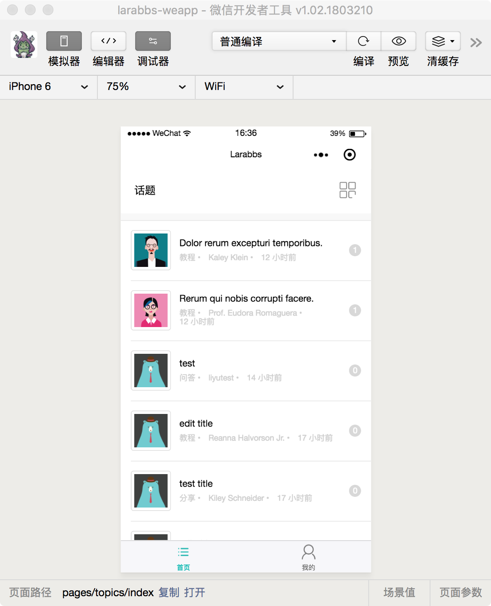

# 10.2. 作品分享和学习感悟

原文链接：https://learnku.com/courses/laravel-weapp/1.7/work-sharing-and-learning/1591

本教程最新版为 [2.1](https://learnku.com/courses/laravel-weapp/2.1)，当前版本已放弃维护，请阅读最新版本！

请点击文章底部的『发起讨论』按钮，提交你的『作品』或者『学习感悟』。提交时候请注意以下几点：

1. 发布时，请选择话题分类为『分享』；

2. 如果你的小程序已经发布，可在文章中贴上小程序二维码，未发布也可附上作品 GitHub 项目链接；

3. 作品可以是完全按着课程做的项目，也可以是基于项目自己变通的版本，后者为佳；

4. 截屏 3 张以上，截屏时候请包含整个开发者工具窗口，如下：

1. 学习感悟是这段时间对学习本课程的总结、理解和下一步的规划；

2. 学习感悟可以与作品搭配一起写，也可以作为单独文章；

3. 也请围观的同学不吝啬你的『点赞』，互相鼓励一起成长 ;-) 。
